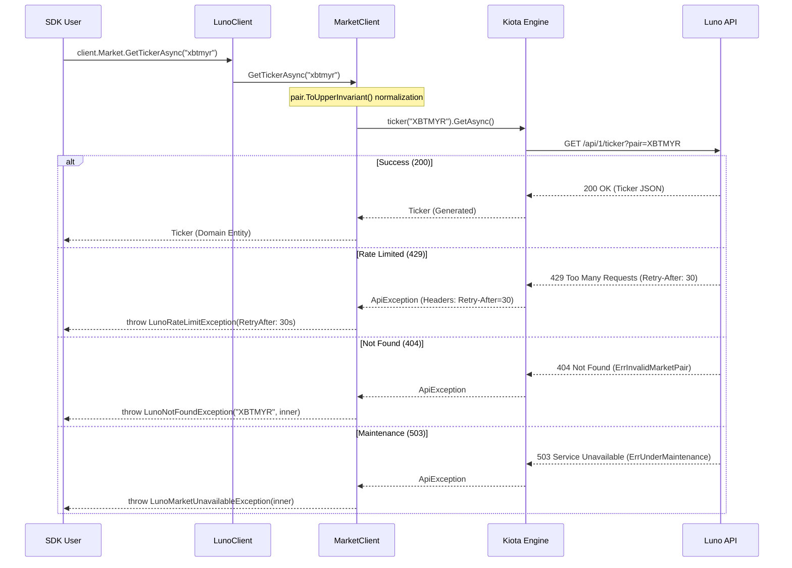

# RFC 004: Single-Pair Ticker Retrieval

**Status:** Draft  
**Date:** 2026-03-11

## 1. Overview
This RFC proposes adding a surgical `GetTickerAsync(string pair)` method to the `ILunoMarketClient`. This allows consumers to fetch the market state of a single trading pair (e.g., "XBTMYR") without the overhead of retrieving all tickers.

## 2. Motivation
Currently, `ILunoMarketClient` only provides `GetTickersAsync`, which returns a list of all available tickers. For applications focused on a specific pair (like a "price-watch" app or a targeted trading bot), this is inefficient and forces unnecessary data processing on the client side. A targeted method improves **Developer Experience (DX)** and **Performance**.

## 3. Future State
Developers can access a specific ticker with a single, clear call:
```csharp
var ticker = await client.Market.GetTickerAsync("xbtmyr"); // Auto-normalized to "XBTMYR"
Console.WriteLine($"Price: {ticker.LastTrade} ({ticker.Status})");
```

## 4. Goals & Non-Goals
- **Goals:**
    - Provide a single-pair retrieval method in the Market Client.
    - Leverage the existing, high-fidelity `Ticker` entity.
    - **Ticker Normalization:** Automatically normalize ticker strings to uppercase to prevent `ErrInvalidMarketPair` due to case sensitivity.
    - **High-Fidelity Error Mapping:** Rely on the API as the Source of Truth and map errors (`401`, `403`, `404`, `429`, `503`) to clear, semantic domain exceptions.
    - **Rate Limit Resilience:** Expose `Retry-After` information in the `LunoRateLimitException` to enable graceful back-off in consumer applications.
- **Non-Goals:**
    - Implementing client-side ticker length or format validation (Delegated to the API).
    - Implementing an automatic retry policy (Out of Scope for this RFC).

## 5. Proposed Technical Design
### High-Level Architecture


### Public API Changes
- **Modified `ILunoMarketClient`**:
    - `Task<Ticker> GetTickerAsync(string pair, CancellationToken ct = default);`
- **New Domain Exceptions** (in `Luno.SDK.Core/Exceptions/`):
    - `LunoRateLimitException`: Thrown on 429 errors.
        - `TimeSpan? RetryAfter { get; init; }`: The duration to wait before retrying.
    - `LunoMarketUnavailableException`: Thrown on 503 errors (e.g., `ErrUnderMaintenance`, `ErrMarketUnavailable`).
    - `LunoNotFoundException`: Thrown on 404 errors (e.g., `ErrInvalidMarketPair`).

### Phased Implementation
### Phase 1: Core Exceptions & Interface
- **Description:** Define the new semantic exceptions and update the Market Client interface.
- **Core Changes:** 
    - Create `LunoRateLimitException.cs`, `LunoMarketUnavailableException.cs`, `LunoNotFoundException.cs`.
    - Modify `ILunoMarketClient.cs`.
- **Locations:** `Luno.SDK.Core/Exceptions/`, `Luno.SDK.Core/Market/ILunoMarketClient.cs`

### Phase 2: Infrastructure Error Mapping
- **Description:** Update the central error handling adapter to translate HTTP codes and extract the `Retry-After` header.
- **Core Changes:** Update `HandleException` in `LunoErrorHandlingAdapter.cs`.
    - Extract `Retry-After` from `ApiException.ResponseHeaders`.
    - Map 404 -> `LunoNotFoundException`.
    - Map 429 -> `LunoRateLimitException(retryAfter)`.
    - Map 503 -> `LunoMarketUnavailableException`.
- **Locations:** `Luno.SDK.Infrastructure/ErrorHandling/LunoErrorHandlingAdapter.cs`

### Phase 3: Infrastructure Client Implementation
- **Description:** Implement the `GetTickerAsync` logic using the Kiota generated client, including ticker normalization.
- **Core Changes:** Implement the logic in `LunoMarketClient.cs` using `pair.ToUpperInvariant()` normalization.
- **Locations:** `Luno.SDK.Infrastructure/Market/LunoMarketClient.cs`

## 6. Behavioral Specifications
### Successful Ticker Retrieval with Normalization
- **Given:**
    - A lowercase trading pair "xbtmyr".
- **When:**
    - `GetTickerAsync("xbtmyr")` is called.
- **Then:**
    - The SDK normalizes the pair to "XBTMYR" and returns the `Ticker` record.
    - Telemetry is emitted with the `luno.market.get_ticker` signal.

### Handling Non-Existent Pair (404)
- **Given:**
    - A non-existent trading pair "NOTAFX".
- **When:**
    - `GetTickerAsync("NOTAFX")` is called.
- **Then:**
    - The SDK throws a `LunoNotFoundException` containing the requested pair.
    - The original `ApiException` is preserved as the `InnerException`.

### Handling Rate Limits (429) with Retry Info
- **Given:**
    - A user has exceeded the rate limit, and the API returns 429 with `Retry-After: 45`.
- **When:**
    - `GetTickerAsync("XBTMYR")` is called.
- **Then:**
    - The SDK throws a `LunoRateLimitException` where `RetryAfter` is equal to 45 seconds.

### Handling Market Maintenance (503)
- **Given:**
    - The Luno API returns a 503 status code with `ErrUnderMaintenance`.
- **When:**
    - `GetTickerAsync("XBTMYR")` is called.
- **Then:**
    - The SDK throws a `LunoMarketUnavailableException`.

### Handling Permission Denied (403)
- **Given:**
    - A trading pair "XBTNGN" that is not enabled for the authenticated user.
- **When:**
    - `GetTickerAsync("XBTNGN")` is called.
- **Then:**
    - The SDK throws a `LunoForbiddenException` (mapped by the central error handler).

### Handling Authentication Failure (401)
- **Given:**
    - Invalid API credentials provided during client initialization.
- **When:**
    - `GetTickerAsync("XBTMYR")` is called.
- **Then:**
    - The SDK throws a `LunoUnauthorizedException` (mapped by the central error handler).

## 7. Definition of Done
### Quality Gates
- 100% test pass on project-core and project-infrastructure.
- XML Documentation for the new method and all new exceptions.
- **TDD Mandate:** Verification must favor behavioral outcomes over internal state. Avoid mocking internal logic; prefer real collaborators unless external/slow I/O is involved.

### Verification Strategy
- `dotnet test --filter "Category=Unit&FullyQualifiedName~Market|Category=Unit&FullyQualifiedName~Exceptions"`

## 8. Alternatives Considered & Trade-offs
- **Alternative A:** Implementing client-side ticker length/format validation. -> Rejected because it adds maintenance overhead and risks breaking when the API introduces new pair formats. Delegated to the API as the Source of Truth.
- **Trade-offs:** Minimal trade-offs; adding semantic exceptions is a core tenet of our **Clean Architecture** mandate.

## 9. Financial Breaking Points
- **Rate Limiting:** High-frequency polling of a single ticker may hit Luno's rate limits (**300 calls per minute**). Exposing `RetryAfter` allows for high-fidelity back-off strategies.
- **Data Freshness:** Data is cached for up to **1 second**. High-frequency bots must account for this "stale window" during rapid price swings.

## 10. Pre-Mortem
- **Failure Scenario:** The `Retry-After` header is missing or in an unexpected format.
- **Mitigation:** The `LunoErrorHandlingAdapter` should handle missing or invalid headers gracefully, leaving `RetryAfter` as `null` and allowing the application to use a default back-off.

## 11. The Kill List
- **Killed:** Brittle client-side ticker validation logic.
- **Killed:** The inefficient "Fetch All and Filter" pattern for single-pair applications.
- **Killed:** Guessing how long to wait after a rate limit hit.
- **Killed:** Ambiguous `ApiException` errors that don't explain *why* a call failed.
