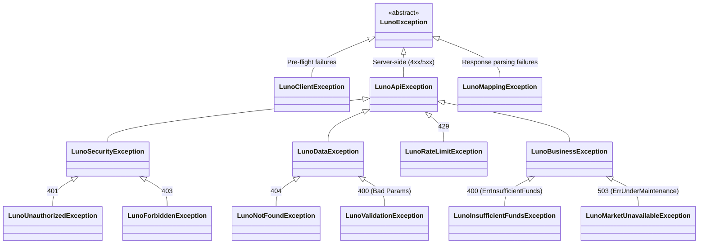

# RFC 004: Unified Domain Exception Hierarchy

**Status:** Draft  
**Date:** 2026-03-11

## 1. Overview
This RFC formalizes the Luno SDK exception hierarchy by reconciling the existing core exceptions with a new, high-fidelity mapping of API error states. We move from a "Transport-Centric" model to a "Behavior-Centric" model.

## 2. Motivation
The current codebase has fragmented exceptions (`LunoDataException`, `LunoSecurityException`). While the user's proposed design added semantic clarity, it introduced unnecessary nesting and naming inconsistencies. We need a hierarchy that is shallow enough to be usable but deep enough to be semantic. Crucially, we must distinguish between data errors (e.g., Not Found) and business rule violations (e.g., Insufficient Funds).

## 3. Future State
Developers can handle errors based on the required action:
```csharp
try {
    await client.Trading.PostLimitOrderAsync(...);
}
catch (LunoInsufficientFundsException) {
    // Action: Trigger deposit (Business state issue)
}
catch (LunoRateLimitException ex) {
    // Action: Back-off for ex.RetryAfter (Operational issue)
}
catch (LunoSecurityException) {
    // Action: Check API Keys (Auth issue)
}
```

## 4. Goals & Non-Goals
- **Goals:**
    - Standardize on `LunoException` as the abstract root.
    - Consolidate all server-side errors under `LunoApiException`.
    - Introduce `LunoBusinessException` for violations of business rules/account state.
    - Map actionable business errors (e.g., Insufficient Funds) to surgical domain exceptions.
    - Leverage existing `LunoDataException` and `LunoSecurityException`.

## 5. Proposed Technical Design
### High-Level Architecture


### Public API Changes
- **Updated Base:** `LunoApiException` (replaces `LunoServiceException`).
- **New Abstract Category:** `LunoBusinessException` (for state-based violations).
- **New Surgical Exceptions:**
    - `LunoInsufficientFundsException` (inherits from `LunoBusinessException`).
    - `LunoRateLimitException` (includes `TimeSpan? RetryAfter`).
    - `LunoMarketUnavailableException` (inherits from `LunoBusinessException`).

### Phased Implementation
### Phase 1: Exception Consolidation
- **Description:** Update existing exceptions to match the new hierarchy and create the missing surgical types.
- **Core Changes:** 
    - Create `LunoBusinessException.cs`.
    - Create `LunoInsufficientFundsException.cs` and `LunoMarketUnavailableException.cs` under the Business family.
    - Create `LunoRateLimitException.cs`.
- **Locations:** `Luno.SDK.Core/Exceptions/`

### Phase 2: Centralized Error Mapping
- **Description:** Implement the exhaustive mapping logic in the request adapter decorator.
- **Core Changes:** Update `LunoErrorHandlingAdapter.cs` to map 400/ErrInsufficientFunds and 503 to the Business family.
- **Locations:** `Luno.SDK.Infrastructure/ErrorHandling/LunoErrorHandlingAdapter.cs`

## 6. Behavioral Specifications
### Handling Insufficient Funds
- **Given:** A 400 response with `ErrorCode: "ErrInsufficientFunds"`.
- **When:** Any API call is made.
- **Then:** The SDK throws `LunoInsufficientFundsException`.

### Handling Rate Limits
- **Given:** A 429 response with `Retry-After: 60`.
- **When:** Any API call is made.
- **Then:** The SDK throws `LunoRateLimitException` with `RetryAfter` set to 60 seconds.

## 7. Definition of Done
### Quality Gates
- 100% pass on `LunoExceptionComplianceTests`.
- All new exceptions documented with XML `<remarks>` explaining the Luno error code they map to.
- **TDD Mandate:** Verification must favor behavioral outcomes over internal state. Avoid mocking internal logic; prefer real collaborators unless external/slow I/O is involved.

## 8. Alternatives Considered & Trade-offs
- **Alternative A:** Inheriting `LunoInsufficientFundsException` from `LunoDataException`. -> Rejected because account balance is a dynamic business state, not a static data integrity issue.
- **Trade-offs:** Adding one more level (`LunoBusinessException`) slightly increases depth but significantly improves semantic clarity for catch-block strategies.

## 9. Financial Breaking Points
- **Incorrect Mapping:** If we map a recoverable business error to a terminal data exception, trading bots might stop unnecessarily.

## 10. Pre-Mortem
- **Failure Scenario:** Luno adds a new "Business Rule" error code (e.g., `ErrOrderTooSmall`).
- **Mitigation:** Developers can still catch `LunoBusinessException` to handle generic state violations while waiting for a specific type.

## 11. The Kill List
- **Killed:** `LunoServiceException` (too generic).
- **Killed:** Ambiguous 400 errors without semantic context.
- **Killed:** Misclassifying state issues as data issues.
