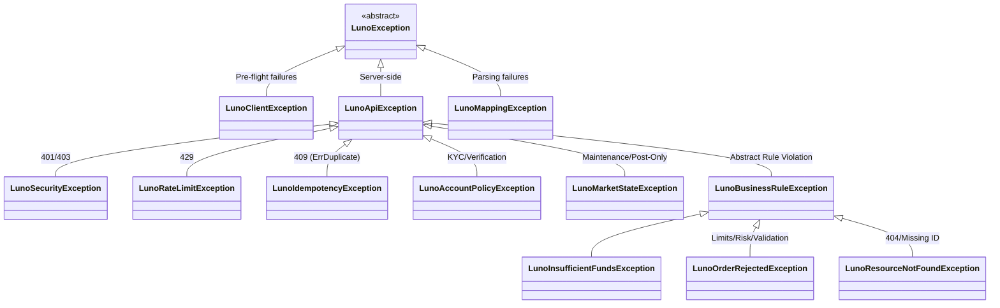

# RFC 004: Unified Domain Exception Hierarchy

**Status:** Draft  
**Date:** 2026-03-11

## 1. Overview
This RFC formalizes the Luno SDK exception hierarchy by reconciling the existing core exceptions with a new, high-fidelity mapping of API error states. We move from a "Transport-Centric" model to a "Behavior-Centric" model.

## 2. Motivation
The current codebase has fragmented exceptions (`LunoDataException`, `LunoSecurityException`). While the user's proposed design added semantic clarity, it introduced unnecessary nesting and naming inconsistencies. We need a hierarchy that is shallow enough to be usable but deep enough to be semantic. Crucially, we must distinguish between data errors (e.g., Not Found) and business rule violations (e.g., Insufficient Funds).

## 3. Future State
Developers can handle errors based on the required action:
```csharp
try {
    await client.Trading.PostLimitOrderAsync(...);
}
catch (LunoInsufficientFundsException) {
    // Action: Trigger deposit (Business state issue)
}
catch (LunoRateLimitException ex) {
    // Action: Back-off for ex.RetryAfter (Operational issue)
}
catch (LunoSecurityException) {
    // Action: Check API Keys (Auth issue)
}
```

## 4. Goals & Non-Goals
- **Goals:**
    - Standardize on `LunoException` as the abstract root.
    - Consolidate all server-side errors under `LunoApiException`.
    - Introduce `LunoBusinessException` for violations of business rules/account state.
    - Map actionable business errors (e.g., Insufficient Funds) to surgical domain exceptions.
    - Leverage existing `LunoDataException` and `LunoSecurityException`.

## 5. Proposed Technical Design
### High-Level Architecture


### Public API Changes
- **New Abstract Categories:** 
    - `LunoBusinessRuleException`: For violations of trading/market rules.
    - `LunoAccountPolicyException`: For KYC, verification, and permission issues.
    - `LunoMarketStateException`: For maintenance and restrictive market modes.
- **New Surgical Exceptions:**
    - `LunoIdempotencyException` (inherits from `LunoApiException`): For `409 Conflict` / `ErrDuplicateClientOrderID`.
    - `LunoOrderRejectedException` (inherits from `LunoBusinessRuleException`): For price/volume limits.
    - `LunoInsufficientFundsException` (inherits from `LunoBusinessRuleException`): Consolidates `ErrInsufficientFunds` and `ErrInsufficientBalance`.
    - `LunoResourceNotFoundException` (inherits from `LunoBusinessRuleException`): Replaces `LunoNotFoundException`.

### Phased Implementation
### Phase 1: Exception Consolidation
- **Description:** Update existing exceptions to match the new behavioral hierarchy.
- **Core Changes:** 
    - Create `LunoBusinessRuleException.cs`, `LunoAccountPolicyException.cs`, `LunoMarketStateException.cs`.
    - Create `LunoIdempotencyException.cs`, `LunoOrderRejectedException.cs`, `LunoInsufficientFundsException.cs`.
    - Rename `LunoNotFoundException` to `LunoResourceNotFoundException`.
- **Locations:** `Luno.SDK.Core/Exceptions/`

### Phase 2: Centralized Error Mapping
- **Description:** Implement the exhaustive mapping logic in the request adapter decorator.
- **Core Changes:** Update `LunoErrorHandlingAdapter.cs` to map by `error_code` string rather than HTTP status.
- **Locations:** `Luno.SDK.Infrastructure/ErrorHandling/LunoErrorHandlingAdapter.cs`

### Error Code Mapping Matrix (Exhaustive)
The following matrix defines the high-fidelity mapping for all 90+ error codes listed in `luno_api_spec.json`.

| Exception Class | Associated Luno Error Codes |
| :--- | :--- |
| **`LunoSecurityException`** | `ErrUnauthorised`, `ErrInsufficientPerms`, `ErrApiKeyRevoked`, `ErrIncorrectPin` |
| **`LunoRateLimitException`** | `ErrTooManyRequests`, `ErrAddressCreateRateLimitReached` |
| **`LunoIdempotencyException`** | `ErrDuplicateClientOrderID`, `ErrDuplicateClientMoveID`, `ErrDuplicateExternalID` |
| **`LunoAccountPolicyException`** | `ErrVerificationLevelTooLow`, `ErrUserNotVerifiedForCurrency`, `ErrTravelRule`, `ErrUpdateRequired`, `ErrUserBlockedForCancelWithdrawal`, `ErrWithdrawalBlocked`, `ErrAccountLimit` |
| **`LunoMarketStateException`** | `ErrUnderMaintenance`, `ErrMarketUnavailable`, `ErrPostOnlyMode`, `ErrMarketNotAllowed`, `ErrCannotTradeWhileQuoteActive` |
| **`LunoResourceNotFoundException`** | `ErrNotFound`, `ErrAccountNotFound`, `ErrBeneficiaryNotFound`, `ErrOrderNotFound`, `ErrWithdrawalNotFound`, `ErrFundsMoveNotFound` |
| **`LunoInsufficientFundsException`** | `ErrInsufficientFunds`, `ErrInsufficientBalance`, `ErrNotEnoughLiquidity` |
| **`LunoOrderRejectedException`** | `ErrAmountTooSmall`, `ErrAmountTooBig`, `ErrPriceTooHigh`, `ErrPriceTooLow`, `ErrVolumeTooLow`, `ErrVolumeTooHigh`, `ErrLimitOutOfRange`, `ErrInvalidPrice`, `ErrInvalidVolume`, `ErrInvalidOrderSide`, `ErrCannotStopUnknownOrNonPendingOrder`, `ErrNoTradesToInferStopDirection`, `ErrStopPriceTooHigh`, `ErrStopPriceTooLow`, `ErrInvalidStopDirection`, `ErrInvalidStopPrice` |
| **`LunoValidationException`** | `ErrInvalidParameters`, `ErrInvalidArguments`, `ErrInvalidAccountID`, `ErrInvalidCurrency`, `ErrInvalidAmount`, `ErrInvalidDetails`, `ErrInvalidMarketPair`, `ErrInvalidClientOrderId`, `ErrInvalidOrderRef`, `ErrInvalidRequestType`, `ErrInvalidSourceAccount`, `ErrInvalidBranchCode`, `ErrInvalidAccountNumber`, `ErrAccountsNotDifferent`, `ErrActiveCryptoRequestExists`, `ErrAddressLimitReached`, `ErrBlockedSendsCurrency`, `ErrCounterDenominationNotAllowed`, `ErrCreditAccountNotTransactional`, `ErrCustomRefNotAllowed`, `ErrDeadlineExceeded`, `ErrDebitAccountNotTransactional`, `ErrDescriptionTooLong`, `ErrDifferentCurrencies`, `ErrDisallowedTarget`, `ErrERC20AddressAlreadyAssigned`, `ErrERC20AssignNonDefault`, `ErrIncompatibleBeneficiary`, `ErrInternal`, `ErrPriceDenominationNotAllowed`, `ErrRejectedBeneficiary`, `ErrRequestTypeDoesNotSupportFastWithdrawals`, `ErrTooManyRowsRequested`, `ErrValueTooHigh`, `ErrVolumeDenominationNotAllowed` |

## 6. Behavioral Specifications
### Handling Insufficient Funds
- **Given:** A 400 response with `ErrorCode: "ErrInsufficientFunds"`.
- **When:** Any API call is made.
- **Then:** The SDK throws `LunoInsufficientFundsException`.

### Handling Rate Limits
- **Given:** A 429 response with `Retry-After: 60`.
- **When:** Any API call is made.
- **Then:** The SDK throws `LunoRateLimitException` with `RetryAfter` set to 60 seconds.

### Handling Idempotency (409)
- **Given:** A 409 response with `ErrorCode: "ErrDuplicateClientOrderID"`.
- **When:** A `PostLimitOrderAsync` call is made with a duplicate ID.
- **Then:** The SDK throws `LunoIdempotencyException`, allowing the caller to recognize the order already exists.

## 7. Definition of Done
### Quality Gates
- **Exception Integrity:** 100% pass on `LunoExceptionComplianceTests` (verifying inheritance, constructors, and serialization).
- **Phased Mapping:** Verified mapping for all endpoints implemented in the current and active RFCs (e.g., Ticker and Order placement).
- **XML Documentation:** All new exceptions documented with XML `<remarks>` explaining the primary Luno error codes they map to.
- **TDD Mandate:** Verification must favor behavioral outcomes over internal state.

## 8. Alternatives Considered & Trade-offs
- **Alternative A:** Mapping by HTTP Status codes. -> Rejected because Luno uses 400 for a massive variety of business, validation, and risk rules.
- **Trade-offs:** Mapping by `error_code` string requires maintaining a comprehensive factory but provides the highest possible fidelity for SDK consumers.

## 9. Financial Breaking Points
- **Idempotency Failure:** Failing to handle 409s correctly can lead to trading bots double-spending or entering inconsistent states.
- **Market State Blindness:** Treating "Post-Only" mode as a general "Maintenance" error prevents bots from adjusting their strategy to remain Makers.

## 10. Pre-Mortem
- **Failure Scenario:** Luno adds a new 400 error code that isn't in our factory.
- **Mitigation:** `LunoApiException` preserves the raw `ErrorCode` string and the `StatusCode`, allowing for manual triage.

## 11. The Kill List
- **Killed:** `LunoServiceException` (too generic).
- **Killed:** Ambiguous 400 errors without semantic context.
- **Killed:** Misclassifying state issues as data issues.
- **Killed:** Blindness to Idempotency (409) conflicts.
- **Killed:** "Classification Fever" (unnecessary nested categories).
