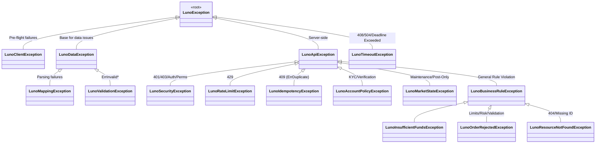

# RFC 004: Unified Domain Exception Hierarchy

**Status:** Implemented  
**Date:** 2026-03-13

## 1. Overview
This RFC formalizes the Luno SDK exception hierarchy by reconciling the existing core exceptions with a new, high-fidelity mapping of API error states. We move from a "Transport-Centric" model to a "Behavior-Centric" model, ensuring that every API error is returned as a semantic domain exception.

## 2. Motivation
The current codebase has fragmented exceptions. We need a hierarchy that is shallow enough to be usable but deep enough to be semantic. Crucially, we must distinguish between data errors, business rule violations, and operational issues. The implementation must also adhere to modern .NET 10 standards, purging legacy serialization patterns.

## 3. Future State
Developers can handle errors based on the required action:
```csharp
try {
    await client.Trading.PostLimitOrderAsync(...);
}
catch (LunoInsufficientFundsException) {
    // Action: Trigger deposit (Business state issue)
}
catch (LunoRateLimitException ex) {
    // Action: Back-off for ex.RetryAfter (Operational issue)
}
catch (LunoSecurityException) {
    // Action: Check API Keys (Auth issue)
}
```

## 4. Goals & Non-Goals
- **Goals:**
    - Standardize on `LunoException` as the root.
    - Consolidate all server-side errors under `LunoApiException`.
    - Provide **Concrete Category Exceptions** (Business, Policy, Market, Security) for broad error handling.
    - Map actionable business errors (e.g., Insufficient Funds) to surgical domain exceptions.
    - Ensure **100% Functional Coverage** for all exception paths and mappings.
    - Purge all obsolete `SerializationInfo` logic (SYSLIB0051).

## 5. Technical Design
### High-Level Architecture


### Public API Changes
- **New Concrete Category Exceptions:** 
    - `LunoBusinessRuleException`: Base for trading/market rule violations.
    - `LunoAccountPolicyException`: Base for KYC, verification, and permission issues.
    - `LunoMarketStateException`: Base for maintenance and restrictive market modes.
    - `LunoSecurityException`: Base for authentication and authorization errors.
- **New Surgical Exceptions:**
    - `LunoIdempotencyException`: For `409 Conflict` and duplicate identifiers.
    - `LunoOrderRejectedException`: For price/volume limits and risk rules.
    - `LunoInsufficientFundsException`: Consolidates `ErrInsufficientFunds` and `ErrInsufficientBalance`.
    - `LunoResourceNotFoundException`: For 404s and missing resource identifiers.
    - `LunoClientException`: For pre-flight failures or client-side validation errors.

### Implementation Realities
#### 1. Modern .NET 10 Pattern
All exceptions follow a standardized 5-constructor pattern, utilizing **Nullable Reference Types (NRT)**. Legacy `BinaryFormatter` serialization constructors and `GetObjectData` overrides are strictly prohibited to avoid `SYSLIB0051` warnings and security risks in .NET 10.

#### 2. High-Performance Dictionary Mapping
The `LunoErrorHandlingAdapter` utilizes a `static readonly Dictionary<string, Func<...>>` registry. This provides O(1) lookups for over 90 Luno error codes and adheres to the **Open-Closed Principle (OCP)**, allowing the mapping to grow without increasing cyclomatic complexity.

#### 3. Reflection-Based Schema Resilience
Because the Luno OpenAPI spec is inconsistent (some endpoints define specific error models with a `Code` property, while others return a generic `ApiException`), the adapter uses **Reflection** to safely access the `Code` property at runtime if it exists on the generated Kiota exception type.

#### 4. The High-Fidelity Safety Net
A final "catch-all" fallback in the adapter ensures that even unmapped HTTP errors (e.g., 502 Bad Gateway, unknown 500s) are wrapped in a `LunoApiException`. **Zero machine-generated exceptions are allowed to leak to the user.**

### Phased Implementation
### Phase 1: Exception Consolidation
- **Description:** Update existing exceptions to match the new behavioral hierarchy.
- **Core Changes:** 
    - Create `LunoBusinessRuleException.cs`, `LunoAccountPolicyException.cs`, `LunoMarketStateException.cs`.
    - Create `LunoIdempotencyException.cs`, `LunoOrderRejectedException.cs`, `LunoInsufficientFundsException.cs`, `LunoTimeoutException.cs`.
    - Rename `LunoNotFoundException` to `LunoResourceNotFoundException`.
- **Locations:** `Luno.SDK.Core/Exceptions/`

### Phase 2: Centralized Error Mapping
- **Description:** Implement the exhaustive mapping logic in the request adapter decorator.
- **Core Changes:** Update `LunoErrorHandlingAdapter.cs` to map by `error_code` string rather than HTTP status.
- **Locations:** `Luno.SDK.Infrastructure/ErrorHandling/LunoErrorHandlingAdapter.cs`

### Error Code Mapping Matrix (Exhaustive)
The following matrix defines the high-fidelity mapping for all 90+ error codes listed in `luno_api_spec.json`.

| Exception Class | Associated Luno Error Codes |
| :--- | :--- |
| **`LunoUnauthorizedException`** | `ErrUnauthorised`, `ErrApiKeyRevoked`, `ErrIncorrectPin` (HTTP 401) |
| **`LunoForbiddenException`** | `ErrInsufficientPerms` (HTTP 403) |
| **`LunoRateLimitException`** | `ErrTooManyRequests`, `ErrAddressCreateRateLimitReached`, `ErrActiveCryptoRequestExists`, `ErrMaxActiveFiatRequestsExists` (HTTP 429) |
| **`LunoTimeoutException`** | `ErrDeadlineExceeded`, HTTP 408, HTTP 504 |
| **`LunoApiException`** | `ErrInternal`, HTTP 500 (Catch-all fallback) |
| **`LunoIdempotencyException`** | `ErrDuplicateClientOrderID`, `ErrDuplicateClientMoveID`, `ErrDuplicateExternalID`, HTTP 409 |
| **`LunoAccountPolicyException`** | `ErrVerificationLevelTooLow`, `ErrUserNotVerifiedForCurrency`, `ErrTravelRule`, `ErrUpdateRequired`, `ErrUserBlockedForCancelWithdrawal`, `ErrWithdrawalBlocked`, `ErrAccountLimit`, `ErrNoAddressesAssigned` |
| **`LunoMarketStateException`** | `ErrUnderMaintenance`, `ErrMarketUnavailable`, `ErrPostOnlyMode`, `ErrMarketNotAllowed`, `ErrCannotTradeWhileQuoteActive` |
| **`LunoResourceNotFoundException`** | `ErrNotFound`, `ErrAccountNotFound`, `ErrBeneficiaryNotFound`, `ErrOrderNotFound`, `ErrWithdrawalNotFound`, `ErrFundsMoveNotFound`, HTTP 404 |
| **`LunoInsufficientFundsException`** | `ErrInsufficientFunds`, `ErrInsufficientBalance` |
| **`LunoOrderRejectedException`** | `ErrAmountTooSmall`, `ErrAmountTooBig`, `ErrPriceTooHigh`, `ErrPriceTooLow`, `ErrVolumeTooLow`, `ErrVolumeTooHigh`, `ErrValueTooHigh`, `ErrInvalidPrice`, `ErrInvalidVolume`, `ErrInvalidOrderSide`, `ErrCannotStopUnknownOrNonPendingOrder`, `ErrNoTradesToInferStopDirection`, `ErrStopPriceTooHigh`, `ErrStopPriceTooLow`, `ErrInvalidStopDirection`, `ErrInvalidStopPrice`, `ErrNotEnoughLiquidity`, `ErrPostOnlyNotAllowed`, `ErrOrderCanceled`, `ErrPriceDenominationNotAllowed`, `ErrVolumeDenominationNotAllowed` |
| **`LunoValidationException`** | `ErrInvalidParameters`, `ErrInvalidArguments`, `ErrInvalidAccount`, `ErrInvalidAccountID`, `ErrInvalidCurrency`, `ErrInvalidAmount`, `ErrInvalidDetails`, `ErrInvalidMarketPair`, `ErrInvalidClientOrderId`, `ErrInvalidOrderRef`, `ErrInvalidRequestType`, `ErrInvalidSourceAccount`, `ErrInvalidBranchCode`, `ErrInvalidAccountNumber`, `ErrAccountsNotDifferent`, `ErrAddressLimitReached`, `ErrBlockedSendsCurrency`, `ErrCounterDenominationNotAllowed`, `ErrCreditAccountNotTransactional`, `ErrCustomRefNotAllowed`, `ErrDebitAccountNotTransactional`, `ErrDescriptionTooLong`, `ErrDifferentCurrencies`, `ErrDisallowedTarget`, `ErrERC20AddressAlreadyAssigned`, `ErrERC20AssignNonDefault`, `ErrIncompatibleBeneficiary`, `ErrRejectedBeneficiary`, `ErrRequestTypeDoesNotSupportFastWithdrawals`, `ErrTooManyRowsRequested`, `ErrInvalidBaseVolume`, `ErrInvalidCounterVolume`, `ErrLimitOutOfRange` |

## 6. Behavioral Specifications
### Handling Unmapped States (Catch-all)
- **Given:** A 502 Bad Gateway response from the Luno Infrastructure.
- **When:** Any API call is made.
- **Then:** The SDK throws a `LunoApiException` wrapping the original error, ensuring type consistency for the caller.

### Handling Schema Inconsistencies
- **Given:** An error response from an endpoint with a missing error schema in OpenAPI.
- **When:** The adapter receives a generic `ApiException`.
- **Then:** The SDK uses reflection to verify if a `Code` property exists; if found, it maps semantically; otherwise, it uses HTTP status code fallback.

## 7. Definition of Done
### Quality Gates
- **Functional Coverage**: **100% verified hits** for all 19 exceptions, metadata constructors, and mapping paths (ignoring XML documentation line anomalies).
- **Exception Integrity**: 100% pass on `LunoExceptionComplianceTests` (verifying inheritance, modern constructors, and property mapping).
- **Phased Mapping**: Verified mapping for all 90+ Luno error codes listed in `luno_api_spec.json`.
- **XML Documentation**: All new exceptions documented with XML `<summary>` and `<remarks>` explaining the primary Luno error codes they map to.
- **TDD Mandate**: Verification must favor behavioral outcomes over internal state.

## 8. The Kill List
- **Killed**: `System.Runtime.Serialization` dependencies (SYSLIB0051).
- **Killed**: Brittle `switch` statements for error mapping.
- **Killed**: Leakage of Kiota `ApiException` to SDK consumers.
- **Killed**: Ambiguous 400 errors without semantic context.
- **Killed**: Misclassifying state issues as data issues.
- **Killed**: Blindness to Idempotency (409) conflicts.
- **Killed**: "Classification Fever" (unnecessary nested categories).
