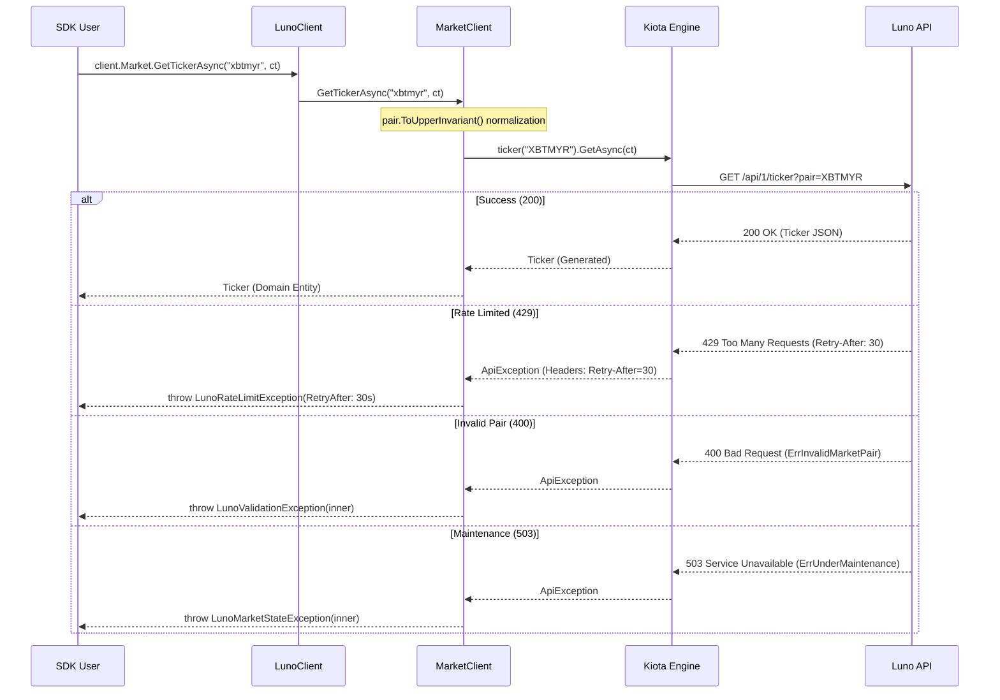

# RFC 005: Single-Pair Ticker Retrieval

**Status:** Draft  
**Date:** 2026-03-11

## 1. Overview
This RFC proposes adding a surgical `GetTickerAsync(string pair)` method to the `ILunoMarketClient`. This allows consumers to fetch the market state of a single trading pair (e.g., "XBTMYR") without the overhead of retrieving all tickers.

## 2. Motivation
Currently, `ILunoMarketClient` only provides `GetTickersAsync`, which returns a list of all available tickers. For applications focused on a specific pair (like a "price-watch" app or a targeted trading bot), this is inefficient and forces unnecessary data processing on the client side. A targeted method improves **Developer Experience (DX)** and **Performance**.

## 3. Future State
Developers can access a specific ticker with a single, clear call:
```csharp
var ticker = await client.Market.GetTickerAsync("xbtmyr"); // Auto-normalized to "XBTMYR"
Console.WriteLine($"Price: {ticker.LastTrade} ({ticker.Status})");
```

## 4. Goals & Non-Goals
- **Goals:**
    - Provide a single-pair retrieval method in the Market Client.
    - Leverage the existing, high-fidelity `Ticker` entity.
    - **Ticker Normalization:** Automatically normalize ticker strings to uppercase to prevent `ErrInvalidMarketPair` due to case sensitivity.
    - **Pre-flight Validation:** Fail fast by throwing a `LunoValidationException` if the `pair` parameter is null, empty, or whitespace.
    - **Compiler Enforcement:** Leverage Nullable Reference Types (NRT) and `WarningsAsErrors` to catch null assignments at compile-time.
    - **High-Fidelity Error Mapping:** Leverage the existing **RFC 004 Unified Domain Exception Hierarchy** to return semantic errors (`LunoUnauthorizedException`, `LunoRateLimitException`, `LunoResourceNotFoundException`, etc.).
- **Non-Goals:**
    - Implementing client-side ticker length or format validation (Delegated to the API).
    - Implementing an automatic retry policy (Out of Scope for this RFC).

## 5. Proposed Technical Design
### High-Level Architecture


### Public API Changes
- **Modified `ILunoMarketClient`**:
    - `Task<Ticker> GetTickerAsync(string pair, CancellationToken ct = default);`

### Implementation Realities
#### 1. DTO Discrepancy (Machine Mud)
The Kiota-generated models for the singular and bulk endpoints are inconsistent:
- **Singular (`/api/1/ticker`)**: Returns `GetTickerResponse` with `int? Timestamp` and `GetTickerResponse_status`.
- **Bulk (`/api/1/tickers`)**: Returns an array of `Ticker` objects with `long? Timestamp` and `Ticker_status`.

To maintain **Clean Architecture**, the Infrastructure layer must map both DTOs to the unified **`Luno.SDK.Core.Market.Ticker`** domain entity, abstracting these inconsistencies from the consumer.

#### 2. Compiler Mandate (Null-Free Lifestyle)
To ensure high-fidelity developer experience, the project strictly enforces Nullable Reference Types. The `.csproj` configuration includes `<WarningsAsErrors>nullable</WarningsAsErrors>`, ensuring that "dumbass moves" (like passing `null` to a non-nullable parameter) are caught as hard **Build Errors**, providing immediate feedback during development.

### Phased Implementation
- **Phase 1: Core Interface**
    - **Description:** Update the Market Client interface to support single-pair retrieval.
    - **Core Changes:** Modify `ILunoMarketClient.cs`.
    - **Locations:** `Luno.SDK.Core/Market/ILunoMarketClient.cs`
- **Phase 2: Infrastructure Mapping**
    - **Description:** Implement high-fidelity mapping for the inconsistent Kiota DTOs.
    - **Core Changes:** Update `MarketMapper.cs` to support mapping from `GetTickerResponse` to the domain `Ticker` entity.
    - **Locations:** `Luno.SDK.Infrastructure/Market/MarketMapper.cs`
- **Phase 3: Infrastructure Client Implementation**
    - **Description:** Implement the `GetTickerAsync` logic using the Kiota generated client, including ticker normalization and centralized error handling.
    - **Core Changes:** Implement the logic in `LunoMarketClient.cs` using `pair.ToUpperInvariant()` normalization and the new `MarketMapper` logic.
    - **Locations:** `Luno.SDK.Infrastructure/Market/LunoMarketClient.cs`

## 6. Behavioral Specifications
### Successful Ticker Retrieval with Normalization
- **Given:**
    - A lowercase trading pair "xbtmyr".
- **When:**
    - `GetTickerAsync("xbtmyr")` is called.
- **Then:**
    - The SDK normalizes the pair to "XBTMYR" and returns the `Ticker` record.
    - Telemetry is emitted with the `luno.market.get_ticker` signal.

### Handling Null or Empty Pair
- **Given:**
    - A null, empty, or whitespace string provided as the `pair` parameter.
- **When:**
    - `GetTickerAsync(pair)` is called.
- **Then:**
    - The SDK throws a `LunoValidationException` immediately without making an API request.

### Handling Invalid Pair (400)
- **Given:**
    - An invalid trading pair identifier "NOTAFX".
- **When:**
    - `GetTickerAsync("NOTAFX")` is called.
- **Then:**
    - The SDK throws a `LunoValidationException` (mapped via RFC 004).
    - The original `ApiException` is preserved as the `InnerException`.

### Handling Rate Limits (429) with Retry Info
- **Given:**
    - A user has exceeded the rate limit, and the API returns 429 with `Retry-After: 45`.
- **When:**
    - `GetTickerAsync("XBTMYR")` is called.
- **Then:**
    - The SDK throws a `LunoRateLimitException` where `RetryAfter` is equal to 45 seconds.

### Handling Market Maintenance (503)
- **Given:**
    - The Luno API returns a 503 status code with `ErrUnderMaintenance`.
- **When:**
    - `GetTickerAsync("XBTMYR")` is called.
- **Then:**
    - The SDK throws a `LunoMarketStateException`.

### Handling Permission Denied (403)
- **Given:**
    - A trading pair "XBTNGN" that is not enabled for the authenticated user.
- **When:**
    - `GetTickerAsync("XBTNGN")` is called.
- **Then:**
    - The SDK throws a `LunoForbiddenException` (mapped by the central error handler).

### Handling Authentication Failure (401)
- **Given:**
    - Invalid API credentials provided during client initialization.
- **When:**
    - `GetTickerAsync("XBTMYR")` is called.
- **Then:**
    - The SDK throws a `LunoUnauthorizedException` (mapped by the central error handler).

## 7. Definition of Done
### Quality Gates
- 100% test pass on project-core and project-infrastructure.
- XML Documentation for the new method and all new exceptions.
- **TDD Mandate:** Verification must favor behavioral outcomes over internal state. Avoid mocking internal logic; prefer real collaborators unless external/slow I/O is involved.

### Verification Strategy
- `dotnet test --filter "Category=Unit&FullyQualifiedName~Market|Category=Unit&FullyQualifiedName~Exceptions"`

## 8. Alternatives Considered & Trade-offs
- **Alternative A:** Implementing client-side ticker length/format validation. -> Rejected because it adds maintenance overhead and risks breaking when the API introduces new pair formats. Delegated to the API as the Source of Truth.
- **Trade-offs:** Minimal trade-offs; adding semantic exceptions is a core tenet of our **Clean Architecture** mandate.

## 9. Financial Breaking Points
- **Rate Limiting:** High-frequency polling of a single ticker may hit Luno's rate limits (**300 calls per minute**). Exposing `RetryAfter` allows for high-fidelity back-off strategies.
- **Data Freshness:** Data is cached for up to **1 second**. High-frequency bots must account for this "stale window" during rapid price swings.

## 10. Pre-Mortem
- **Failure Scenario:** The `Retry-After` header is missing or in an unexpected format.
- **Mitigation:** The `LunoErrorHandlingAdapter` should handle missing or invalid headers gracefully, leaving `RetryAfter` as `null` and allowing the application to use a default back-off.

## 11. The Kill List
- **Killed:** Brittle client-side ticker validation logic.
- **Killed:** The inefficient "Fetch All and Filter" pattern for single-pair applications.
- **Killed:** Guessing how long to wait after a rate limit hit.
- **Killed:** Ambiguous unmapped exceptions (Superceded by **RFC 004 Exception Hierarchy**).

## Appendix: Raw API Response Examples
To ensure high-fidelity mapping in `MarketMapper.cs`, the following raw JSON examples and official **Luno Conventions** should be used as the Source of Truth.

### 1. Official Timestamp Convention
As per the `luno_api_spec.json` Conventions section:
> "Timestamps are always represented as an integer number of milliseconds since the UTC Epoch (a Unix timestamp)."

**Mandate:** All domain entities and infrastructure mappings must use `long` (64-bit) for timestamps to prevent overflow of 13-digit millisecond values.

### 2. Singular Ticker (`GET /api/1/ticker`)
```json
{
  "ask": "1000000.00",
  "bid": "999000.00",
  "last_trade": "999500.00",
  "pair": "XBTZAR",
  "rolling_24_hour_volume": "12.34",
  "status": "ACTIVE",
  "timestamp": 1710300000000
}
```
**Note:** Kiota incorrectly generates `int? Timestamp` for this DTO, which will overflow at runtime. The mapper must handle this high-fidelity discrepancy.

### 2. Bulk Tickers (`GET /api/1/tickers`)
```json
{
  "tickers": [
    {
      "ask": "1000000.00",
      "bid": "999000.00",
      "last_trade": "999500.00",
      "pair": "XBTZAR",
      "rolling_24_hour_volume": "12.34",
      "status": "ACTIVE",
      "timestamp": 1710300000000
    }
  ]
}
```
**Note:** Each item in the array is generated as a `Ticker` DTO with `long? Timestamp`, providing the correct capacity.
