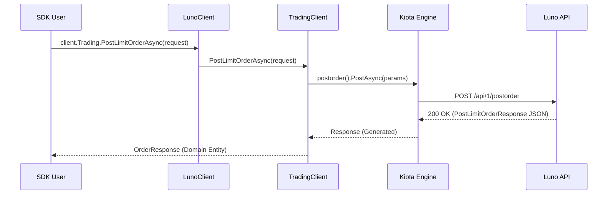

# RFC 006: Trading Client and Limit Order Placement

**Status:** Draft  
**Date:** 2026-03-11

## 1. Overview
This RFC proposes the introduction of a new `ILunoTradingClient` to handle order placement and management. The primary focus of this RFC is the implementation of the `POST /api/1/postorder` endpoint to enable limit order placement within the SDK.

## 2. Motivation
The Luno SDK currently lacks the ability to interact with the exchange's order book. To build functional trading applications, users must be able to place buy and sell orders. Separating trading logic into its own client (`ILunoTradingClient`) maintains the **Single Responsibility Principle (SRP)** and keeps the `ILunoAccountClient` focused on balances and account metadata.

## 3. Future State
Developers can place orders with a fluent, type-safe API that leverages the domain exception hierarchy for robust error handling:
```csharp
var orderResponse = await client.Trading.PostLimitOrderAsync(new PostLimitOrderRequest
{
    Pair = "XBTMYR",
    Type = OrderType.Bid,
    Volume = 0.001m,
    Price = 250000m,
    PostOnly = true
});
Console.WriteLine($"Order placed: {orderResponse.OrderId}");
```

## 4. Goals & Non-Goals
- **Goals:**
    - Introduce `ILunoTradingClient` and its infrastructure implementation.
    - Implement `PostLimitOrderAsync` for limit orders.
    - **High-Fidelity Domain Mapping:** Map specific exchange errors (`ErrInsufficientFunds`, `ErrPostOnly`, `ErrInvalidPrice`) to RFC 003 exceptions.
    - **Type-Safety:** Define enums for `OrderType`, `TimeInForce`, and `StopDirection`.
- **Non-Goals:**
    - Implementing Market Orders (`POST /api/1/marketorder`) in this RFC (Phase 2).
    - Implementing Stop Orders in this RFC.
    - Implementing Order Cancellation (`DELETE /api/1/orders/{id}`).

## 5. Proposed Technical Design
### High-Level Architecture


### Public API Changes
- **New Interface `ILunoTradingClient`**:
    - `Task<OrderResponse> PostLimitOrderAsync(PostLimitOrderRequest request, CancellationToken ct = default);`
- **New Enums**:
    - `OrderType` (BID, ASK)
    - `TimeInForce` (GTC, IOC, FOK)
    - `StopDirection` (BELOW, ABOVE, RELATIVE_LAST_TRADE)

### Phased Implementation
### Phase 1: Trading Core
- **Description:** Define the interface, enums, and request/response models.
- **Core Changes:** Create `ILunoTradingClient.cs`, `OrderType.cs`, and `PostLimitOrderRequest.cs`.
- **Locations:** `Luno.SDK.Core/Trading/`

### Phase 2: Infrastructure & Mapping
- **Description:** Implement the client and map to Kiota's generated types.
- **Core Changes:** Create `LunoTradingClient.cs` and update `LunoClient` to expose the trading client.
- **Locations:** `Luno.SDK.Infrastructure/Trading/`, `Luno.SDK.Application/LunoClient.cs`

### Phase 3: High-Fidelity Error Mapping
- **Description:** Map specific exchange errors to our domain exception hierarchy.
- **Core Changes:** Update `LunoExceptionMapper` for:
    - `ErrInsufficientFunds` -> `LunoInsufficientFundsException`
    - `ErrPostOnly` -> `LunoPostOnlyViolationException`
    - `ErrInvalidPrice` -> `LunoValidationException` (with details)
- **Locations:** `Luno.SDK.Infrastructure/Exceptions/LunoExceptionMapper.cs`

## 6. Behavioral Specifications
### Successful Limit Order Placement
- **Given:**
    - A valid `PostLimitOrderRequest` with sufficient funds.
- **When:**
    - `PostLimitOrderAsync` is called.
- **Then:**
    - The SDK returns an `OrderResponse` containing a valid `OrderID`.
    - Telemetry is emitted with the `luno.trading.post_order` signal.

### Insufficient Funds
- **Given:**
    - A request where the user's balance is lower than the order cost + fees.
- **When:**
    - `PostLimitOrderAsync` is called.
- **Then:**
    - The SDK throws a `LunoInsufficientFundsException` (mapped from `ErrInsufficientFunds`).

### Post-Only Violation
- **Given:**
    - A `PostOnly` order that would match an existing order immediately (Taker trade).
- **When:**
    - `PostLimitOrderAsync` is called.
- **Then:**
    - The SDK throws a `LunoPostOnlyViolationException` (mapped from `ErrPostOnly`).

## 7. Definition of Done
### Quality Gates
- 100% test pass on project-core and project-infrastructure.
- Complete XML documentation for all new public members.
- **TDD Mandate:** Verification must favor behavioral outcomes over internal state. Avoid mocking internal logic; prefer real collaborators unless external/slow I/O is involved.

### Verification Strategy
- `dotnet test --filter "Category=Unit&FullyQualifiedName~Trading"`

## 8. Alternatives Considered & Trade-offs
- **Alternative A:** Adding these methods to `ILunoAccountClient`. -> Rejected because account management and active trading are distinct behavioral domains (SRP).
- **Trade-offs:** Minimal trade-offs; adding a dedicated trading client is the standard pattern for high-fidelity exchange SDKs.

## 9. Financial Breaking Points
- **Rate Limiting:** Trading endpoints share the global rate limit of **300 calls per minute**. Bots must prioritize trading calls over market data calls during high-volatility events.
- **Slippage & Post-Only:** Using `PostOnly` ensures the user is a **Maker** (lower fees), but it introduces the risk of the order being rejected (`ErrPostOnly`) if the spread is narrow.
- **Tick Size & Precision:** Each pair has specific tick size requirements. If the `Price` or `Volume` doesn't match the pair's precision, `ErrInvalidPrice` will be returned.

## 10. Pre-Mortem
- **Failure Scenario:** A network timeout occurs after the order is sent to Luno but before the response is received.
- **Mitigation:** The SDK should include a recommendation in the docs for users to perform a "reconnaissance" call to `GetOrders` if a timeout occurs.
- **Failure Scenario:** The user provides a volume that is below the pair's "Minimum Trade Volume".
- **Mitigation:** Future RFCs should include a "Pair Metadata" service to allow the SDK to perform client-side pre-validation.

## 11. The Kill List
- **Killed:** The ambiguity of "Account" vs "Trading" responsibilities.
- **Killed:** Untyped string parameters for order types.
- **Killed:** Manual parsing of error strings for critical trading failures.
