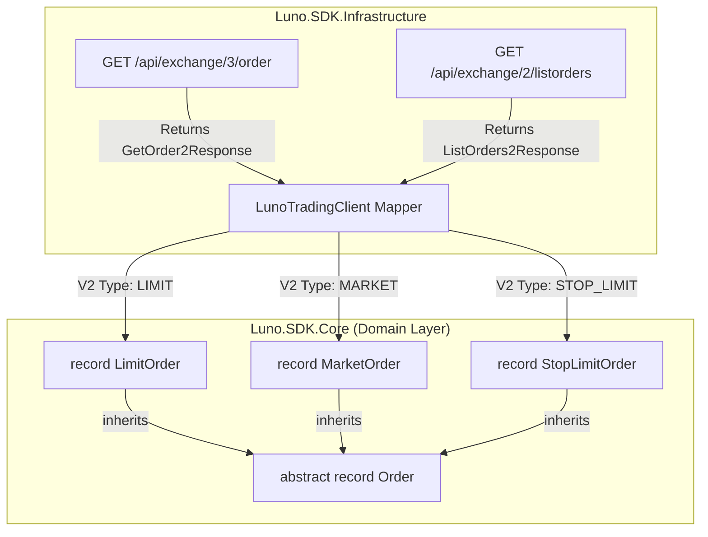

# RFC 006ext01: Domain-Driven Order Specialization (V2 Ready)

**Status:** Draft (Revised)  
**Date:** 2026-03-16  
**Author(s):** Gemini CLI

## 1. Executive Summary: The Vision & The Value
- **The What & The Why:** We are splitting the current "fat" `Order` record into specialized leaf records. This revision adopts the Luno V2 API ontology, separating `OrderType` (behavior) from `OrderSide` (intent).
- **Business & System ROI:** Future-proofs the SDK for Luno V2 adoption while solving the current build failures caused by mandatory field enforcement on a non-specialized model.
- **The Future State:** Intent-explicit domain types with enforced business invariants, preventing "garbage-in" data from legacy or inconsistent API responses.

## 2. The Status Quo & The Timebombs
- **The Urgency (Why Now?):** RFC 006 implementation is blocked by 13 build errors. Attempting to fix them with a V1-only mindset is a "one-way door" to technical debt.
- **The Timebombs (Assumptions):** 
    - *Assumption:* Inheritance must follow `StopLimit : Limit`. *Reality:* Stop orders might trigger market executions.
    - *Assumption:* `BID/ASK` is sufficient. *Reality:* Luno V2 explicitly uses `BUY/SELL` across all types.

## 3. Goals & The Scope Creep Shield
- **Goals:** 
    - Implement a V2-aligned hierarchy: `LimitOrder`, `MarketOrder`, `StopLimitOrder`.
    - Enforce the "At least one AccountId" invariant via static factory methods.
    - Resolve the 13 build errors in `Luno.SDK.Tests.Unit`.
- **Non-Goals:** 
    - Full implementation of `POST /api/1/marketorder` (Phase 2).

## 4. Proposed Technical Design
### 4.1 Architecture & Boundaries


### 4.2 Public Contracts & Schema Mutations
#### 📦 Domain Models
- **Enums:**
    - `OrderSide`: `Buy`, `Sell` (maps to V2 `BUY/SELL`).
    - `OrderType`: `Limit`, `Market`, `StopLimit`.

- **Domain Models:**
    - **`abstract record Order`** (Shared Identity):
        - `required string OrderId`
        - `required OrderSide Side`
        - `required OrderStatus Status`
        - `required string Pair`
        - `required long CreationTimestamp`
        - `long? CompletedTimestamp`, `long? ExpirationTimestamp`
        - `required long? BaseAccountId`, `required long? CounterAccountId`
        - `decimal? FilledBase`, `decimal? FilledCounter`, `FeeBase`, `FeeCounter`
        - **Validation**: Must specify at least one AccountId.

    - **`record LimitOrder : Order`**:
        - `required decimal LimitPrice`, `required decimal LimitVolume`
        - `TimeInForce TimeInForce`

    - **`record MarketOrder : Order`**: (No behavior-specific required fields for retrieval).

    - **`record StopLimitOrder : Order`**:
        - `required decimal StopPrice`, `required StopDirection StopDirection`
        - `required decimal LimitPrice`, `required decimal LimitVolume`

#### 🚀 Infrastructure Contracts (Endpoint Upgrades)
- **`FetchOrderAsync`**: Will utilize the **V3** endpoint (`/api/exchange/3/order`). This endpoint supports lookup by `client_order_id` and returns the modern `GetOrder2Response`.
- **`FetchListOrdersAsync`**: Will be upgraded from V1 to **V2** (`/api/exchange/2/listorders`). This ensures the list returns the modern `OrderV2` objects with account IDs and separated type/side.

### 4.3 Invariant Enforcement (Strict Immortality)
To eliminate the risk of developers bypassing domain invariants via object initializers (which execute after constructors), we will adopt **Strictly Immutable Records**. All sensitive fields will utilize get-only properties, forcing all state through a validated constructor.

```csharp
public abstract record Order
{
    public string OrderId { get; }
    public OrderSide Side { get; }
    public OrderStatus Status { get; }
    public string Pair { get; }
    public long CreationTimestamp { get; }
    public long? BaseAccountId { get; }
    public long? CounterAccountId { get; }
    // ... other fields ...

    protected Order(string orderId, OrderSide side, OrderStatus status, string pair, long creationTimestamp, long? baseAccountId, long? counterAccountId)
    {
        if (baseAccountId == null && counterAccountId == null)
            throw new LunoValidationException("Domain Invariant Violation: An order must specify at least a BaseAccountId or a CounterAccountId.");

        OrderId = orderId;
        Side = side;
        Status = status;
        Pair = pair;
        CreationTimestamp = creationTimestamp;
        BaseAccountId = baseAccountId;
        CounterAccountId = counterAccountId;
    }
}

public record LimitOrder : Order
{
    public decimal LimitPrice { get; }
    public decimal LimitVolume { get; }
    public TimeInForce TimeInForce { get; }

    public LimitOrder(string orderId, OrderSide side, OrderStatus status, string pair, long creationTimestamp, long? baseAccountId, long? counterAccountId, decimal price, decimal volume, TimeInForce tif = TimeInForce.GTC)
        : base(orderId, side, status, pair, creationTimestamp, baseAccountId, counterAccountId)
    {
        LimitPrice = price;
        LimitVolume = volume;
        TimeInForce = tif;
    }
}
```

By removing `init` setters, we ensure the compiler prevents any post-construction modification, making the domain invariants truly bulletproof.

## 5. Execution, Rollout, & The Sunset
- **Phase 1**: Implement records and factory in `Luno.SDK.Core`.
- **Phase 2**: Refactor `LunoTradingClient` to map V1/V2 responses to the new types.
- **Phase 3**: Update tests to use specific record subtypes, resolving build errors.

## 6. Definition of Done
- `dotnet build` returns 0 errors.
- Unit tests verify mapping from `LIMIT`, `MARKET`, and `STOP_LIMIT` Kiota responses.
- Invariant validation is tested for `null` account edge cases.
