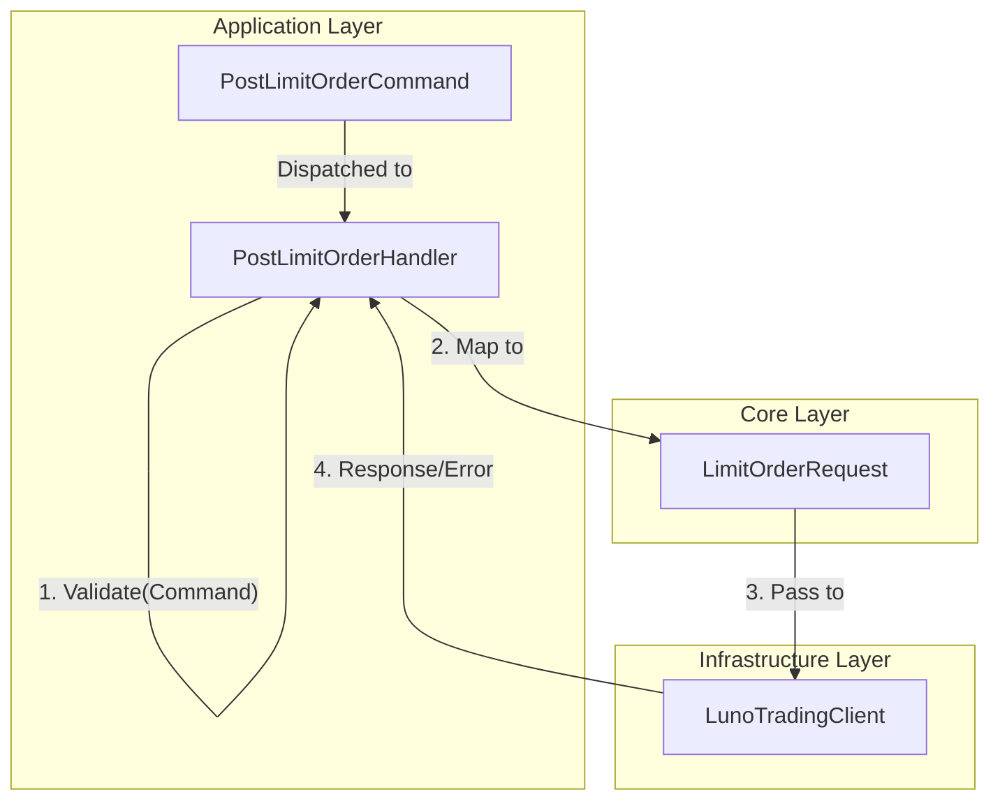

# RFC 006 Ext 02: Boundary Purity and Use Case Validation

**Status:** Draft 📝  
**Date:** 2026-03-26  
**Author(s):** Gemini CLI  
**Base RFC:** [RFC 006: Trading Client and Order Lifecycle Management](./RFC006_TradingClientAndLimitOrderPlacement.md)

## 1. Executive Summary: The Vision & The Value
- **The What & The Why:** We must refactor input validation logic out of boundary-crossing request objects. Attaching a `Validate()` method to boundary objects violates the principle that data crossing architectural boundaries must consist solely of isolated, simple data structures.
- **Business & System ROI:** This ensures that source code dependencies point only inward toward higher-level policies, eliminating the risk of outer layers depending on inner layer behavior while retaining the efficiency of minimized mapping.
- **The Future State:** Boundary models remain pure, behavior-free data structures. All validation logic is encapsulated directly inside Use Case Interactors, making the system's "Application Rules" explicit and centralized.

## 2. The Status Quo & The Timebombs
- **The Urgency (Why Now?):** Current implementations (e.g., `LimitOrderParameters`) contain a `Validate()` method. This "leaks" behavioral logic into what should be a passive data structure, creating a "dumb pipe" that isn't actually dumb.
- **The Timebombs (Assumptions):** 
    - Assuming that a DTO "knowing" its own rules is safer. (In reality, it couples the DTO to the validation logic and the exceptions it throws).
    - Assuming that validation is a "Domain" concern for value objects. (Input field validation is fundamentally an *Application-specific* business rule).

## 3. Goals & The Scope Creep Shield
- **Goals:**
    - **Delete** the redundant `LimitOrderParameters` class from `Luno.SDK.Core`.
    - **Remove** all `Validate()` methods from boundary DTOs in `Luno.SDK.Core` and `Luno.SDK.Application`.
    - **Relocate** all validation logic into the `HandleAsync` method of the corresponding `ICommandHandler` (Use Case Interactors). This logic **MUST** be encapsulated in **private helper methods** (e.g., `Validate(Command)`) within the Handler to ensure the orchestrating `HandleAsync` method remains clean and readable (avoiding "God handle" functions).
    - **Transition** to a "Single Mapping" pattern: `Command` -> `Request` (behavior-free).

- **Non-Goals (The Shield):**
    - This RFC does NOT cover domain entity validation (e.g., `Order` state transitions).
    - This RFC does NOT cover infrastructure-level validation (e.g., HTTP 400 responses from the Luno API).

## 4. Proposed Technical Design
### 4.1 Audit of Validation Points (The "What" and "Where")

The following validation rules are being relocated from boundary objects (Core) and inline logic to **private helper methods** within the Application Handlers:

| Use Case | Validation Rule | Implementation Note |
| :--- | :--- | :--- |
| **PostLimitOrder** | **Explicit Account Mandate**: Both `BaseAccountId` and `CounterAccountId` must be present. | Move from `LimitOrderParameters.Validate()` to `PostLimitOrderHandler.Validate(Command)`. |
| **PostLimitOrder** | **PostOnly Invariant**: `PostOnly` is incompatible with any `TimeInForce` except `GTC`. | Move from `LimitOrderParameters.Validate()` to `PostLimitOrderHandler.Validate(Command)`. |
| **PostLimitOrder** | **Stop-Limit Invariant**: `StopPrice` and `StopDirection` must be provided together. | Move from `LimitOrderParameters.Validate()` to `PostLimitOrderHandler.Validate(Command)`. |
| **PostLimitOrder** | **Enum Range Checks**: Verify `Side`, `TimeInForce`, and `StopDirection` are defined. | Move from `LimitOrderParameters.Validate()` to `PostLimitOrderHandler.Validate(Command)`. |
| **StopOrder** | **Identity Mandate**: Either `OrderId` or `ClientOrderId` must be provided. | Move from inline `HandleAsync` logic to `StopOrderHandler.Validate(Command)`. |
| **GetTicker** | **Pair Mandate**: The market pair string must not be null or whitespace. | **New**: Add `GetTickerHandler.Validate(Query)`. |
| **ListOrders** | **Limit Range**: If provided, `Limit` must be between 1 and 1000. | **New**: Add `ListOrdersHandler.Validate(Query)`. |

### 4.2 Architecture & Boundaries

### 4.2 Public Contracts & Schema Mutations
- **Luno.SDK.Core**: 
    - **Delete**: `LimitOrderParameters.cs`.
    - **Update**: `LimitOrderRequest.cs` (Ensure it remains behavior-free).
- **Luno.SDK.Application**:
    - **Update**: `PostLimitOrderHandler.cs` (Handle `Command` -> `Request` directly and own all validation).
    - **Update**: `StopOrderHandler.cs` (Perform exhaustive validation of command inputs).

## 5. Execution, Rollout, & The Sunset
- **Phase 1: The Kill List**
    - Delete `LimitOrderParameters.cs`.
- **Phase 2: Relocate Logic to Application**
    - Move validation rules into `PostLimitOrderHandler.HandleAsync`.
    - Refactor `PostLimitOrderHandler` to map `PostLimitOrderCommand` directly to `LimitOrderRequest`.
- **Phase 3: Audit & Align All Handlers**
    - Review `GetTickerHandler`, `StopOrderHandler`, etc., to ensure they don't delegate validation to their input objects.
- **Phase X: The Sunset**
    - Purge all unit tests that call `Validate()` on DVOs and point them to the Handler.

## 6. Behavioral Contracts
### 6.1 Input Validation (Application Rule)
- **Tier:** Unit
- **Given:** A `PostLimitOrderCommand` with `PostOnly = true` and `TimeInForce = IOC`.
- **When:** `PostLimitOrderHandler.HandleAsync` is called.
- **Then:** Throws `LunoValidationException` with message "PostOnly cannot be used with a TimeInForce other than GTC."
- **Verification:** Assert that the exception is thrown by the handler, not by the command object itself.

### 6.2 Explicit Account Mandate
- **Tier:** Unit
- **Given:** A `PostLimitOrderCommand` with missing `BaseAccountId`.
- **When:** `PostLimitOrderHandler.HandleAsync` is called.
- **Then:** Throws `LunoValidationException` with "Explicit Account Mandate violated."
- **Verification:** Handler logic check.

## 7. Operational Reality
- **Blast Radius:** Low. This is a pure internal refactoring to align with Clean Architecture.
- **Observability:** Validation failures are already tracked via telemetry in the `LunoTelemetryAdapter`.

## 8. Disaster Recovery & The Panic Button
- **The "Panic Button":** Git revert. Since this is a structural refactor, it is binary in its success.

## 9. The Pre-Mortem & Trade-offs
- **Rejected Options:**
    - **Self-Validating DVOs:** Rejected because it couples data structures to behavioral logic and violates boundary purity.
    - **FluentValidation:** Rejected to keep the SDK zero-dependency and lean.
- **The Pre-Mortem:** If this fails, it's likely because we missed an edge case during the relocation of logic. We mitigate this by migrating existing unit tests to target the handlers instead of the DVOs.

## 10. Definition of Done
- All `Validate()` methods removed from DTOs/DVOs.
- `PostLimitOrderHandler` contains all validation logic for limit orders.
- `StopOrderHandler` contains all validation logic for stopping orders.
- Existing unit tests updated to verify validation through handlers.
- 100% test pass across the solution.
