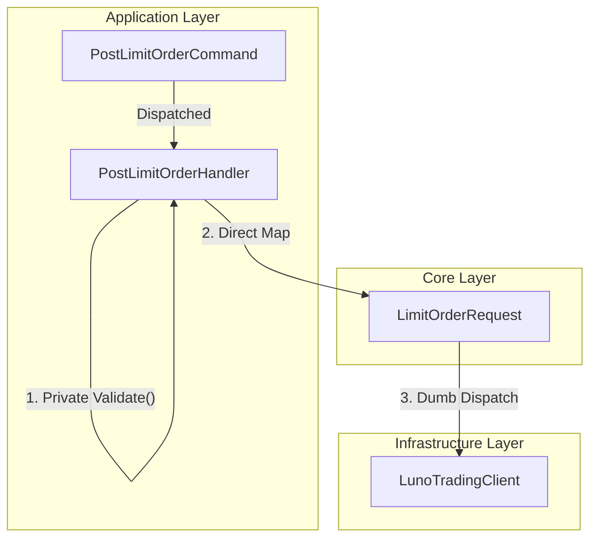

# RFC 006 Ext 02: Boundary Purity and Use Case Validation

**Status:** Draft 📝  
**Date:** 2026-03-26  
**Author(s):** Gemini CLI  
**Base RFC:** [RFC 006: Trading Client and Order Lifecycle Management](./RFC006_TradingClientAndLimitOrderPlacement.md)

## 1. Executive Summary: The Vision & The Value
- **The What & The Why:** This RFC mandates the total removal of behavioral logic from boundary-crossing data structures. By relocating input validation from "Self-Validating" DTOs in `Core` to private helpers within the `Application` Handlers, we align the system with the Single Responsibility Principle (SRP) and enforce absolute boundary purity.
- **Business & System ROI:** This change eliminates "behavioral leakage" where the Infrastructure layer could inadvertently trigger internal validation logic. It simplifies the domain model by removing redundant Value Objects (`LimitOrderParameters`) and consolidating on a single, passive contract (`LimitOrderRequest`).
- **The Future State:** The `Core` layer defines the "Ubiquitous Language" of the exchange via passive contracts, while the `Application` layer owns the rules for how those contracts are populated and validated. The system becomes a set of "Dumb Pipes" orchestrated by "Smart Handlers."

## 2. The Status Quo & The Timebombs
- **The Urgency (Why Now?):** Currently, the SDK uses "Self-Validating" objects like `LimitOrderParameters`. This creates a "Gun on the Table" scenario where future developers might call `Validate()` from the Infrastructure layer, coupling low-level implementation to high-level policy.
- **The Timebombs (Assumptions):** 
    - **Redundancy Debt**: Maintaining both `LimitOrderParameters` and `LimitOrderRequest` creates a "Double Mapping" tax that offers no architectural benefit once validation is centralized.
    - **Contextual Drift**: Assuming validation is a "Domain" invariant. In reality, validation requirements change whenever a Use Case changes, meaning they share the same "Reason to Change" and belong in the same layer.

## 3. Goals & The Scope Creep Shield
- **Goals:**
    - **Delete** the redundant `LimitOrderParameters` class from `Luno.SDK.Core`.
    - **Enforce Boundary Passivity**: Remove all `Validate()` methods from request and command objects.
    - **Centralize Orchestration**: Move all input validation into private helper methods within the `ICommandHandler` implementation.
    - **Consolidate Contracts**: Use `LimitOrderRequest` (Core) as the single source of truth for the exchange boundary.
- **Non-Goals (The Shield):**
    - This RFC does NOT cover domain entity validation (e.g., `Order` state transitions).
    - This RFC does NOT cover infrastructure-level validation (e.g., HTTP 400 responses from the Luno API).

## 4. Proposed Technical Design
### 4.1 Audit of Validation Points (The "What" and "Where")

The following validation rules are being relocated from boundary objects (Core) and inline logic to **private helper methods** within the Application Handlers:

| Use Case | Validation Rule | Implementation Note |
| :--- | :--- | :--- |
| **PostLimitOrder** | **Explicit Account Mandate**: Both Account IDs must be present. | Move to `PostLimitOrderHandler.Validate(Command)`. |
| **PostLimitOrder** | **PostOnly Invariant**: `PostOnly` is incompatible with non-GTC TIF. | Move to `PostLimitOrderHandler.Validate(Command)`. |
| **PostLimitOrder** | **Stop-Limit Invariant**: Co-dependency of Price/Direction. | Move to `PostLimitOrderHandler.Validate(Command)`. |
| **StopOrder** | **Identity Mandate**: `OrderId` or `ClientOrderId` required. | Move to `StopOrderHandler.Validate(Command)`. |
| **GetTicker** | **Pair Mandate**: Pair string must be non-empty. | Add to `GetTickerHandler.Validate(Query)`. |
| **ListOrders** | **Limit Range**: 1-1000 inclusive. | Add to `ListOrdersHandler.Validate(Query)`. |

### 4.2 Architecture & Boundaries

### 4.3 SRP Alignment: Validation as a Use Case Concern
The Single Responsibility Principle (SRP) dictates that a module should have one reason to change. Input validation requirements (e.g., "Must provide both Account IDs") are inextricably linked to the **Application Use Case**. If the business requirement for placing an order changes, both the Handler and the validation rules change together. Moving this logic into the Handler ensures that "things that change for the same reason stay together."

### 4.4 Boundary Purity: Eliminating the "Gun on the Table"
Attaching a `Validate()` method to a DTO creates a behavioral dependency. In a Clean Architecture, the Infrastructure layer should be a "Dumb Pipe" that merely translates data. Providing a public `Validate()` method on a boundary-crossing object risks the Infrastructure layer (or any other "Outer" layer) performing validation, which is a leak of Application policy. Purging these methods ensures that boundary objects are purely passive data carriers.

### 4.5 Ubiquitous Language as Core Contracts
While `LimitOrderRequest` is a boundary-crossing DTO, it is defined in the `Core` layer because it represents the **Ubiquitous Language** of the Luno exchange. The specialized sub-clients (e.g., `ILunoTradingOperations`) are the SDK's primary policy interfaces. For these interfaces to remain independent of the Infrastructure layer (D.I.P.), the objects they accept (`LimitOrderRequest`) must reside in the `Core` layer, serving as the stable vocabulary for the entire system.

### 4.6 Rationale: Use Case Orchestration and Mapping Stability
The primary responsibility of the **Application Layer** is to translate an external `Command` (representing user intent and orchestration metadata) into a valid `Request` for the Luno API (representing the infrastructure contract).

By centralizing validation and mapping within the Handler:
1.  **Orchestration Metadata**: Commands can safely carry metadata (e.g., `RetryCount`, `Priority`, or `TelemetryTags`) that the `Request` DTO should never see.
2.  **Decoupled Evolution**: We are **not tied to a 1:1 mapping**. If the external Command and the internal API Request diverge, the Handler acts as the stable translator. We can introduce private helper methods or specialized mapping classes within the Application layer to manage this complexity without leaking it into the `Core` vocabulary.
3.  **Policy Enforcement**: Input validation is the final "Gatekeeper" of the Use Case. Moving it to the Handler ensures that the "Rules of Engagement" for a specific API operation are explicit, centralized, and easy to audit.

## 5. Execution, Rollout, & The Sunset
- **Phase 1: The Kill List**
    - Delete `LimitOrderParameters.cs`.
- **Phase 2: Relocate Logic to Application**
    - Move validation rules into `PostLimitOrderHandler.HandleAsync` via `private void Validate(...)`.
    - Refactor `PostLimitOrderHandler` to map `PostLimitOrderCommand` directly to `LimitOrderRequest`.
- **Phase 3: Audit & Align All Handlers**
    - Ensure all Handlers implement private `Validate` helpers for their respective inputs.
- **Phase X: The Sunset**
    - Purge all unit tests targeting DVO `Validate()` methods.

## 6. Behavioral Contracts
### 6.1 Use Case Integrity (Happy Path)
- **Tier:** Unit
- **Given:** A valid `PostLimitOrderCommand`.
- **When:** `HandleAsync` is executed.
- **Then:** Validation passes, mapping occurs, and the `ILunoTradingOperations` is called with a passive `LimitOrderRequest`.

### 6.2 Application Rule Enforcement (Chaos Path)
- **Tier:** Unit
- **Given:** A `PostLimitOrderCommand` that violates a domain invariant (e.g., PostOnly with IOC).
- **When:** `HandleAsync` is executed.
- **Then:** The Handler throws `LunoValidationException` before the mapping or dispatch phases.

## 7. Operational Reality
- **Blast Radius:** **High (Breaking Change)**. This refactoring removes public types and methods from `Luno.SDK.Core`. 
- **Observability:** Telemetry remains unchanged as validation exceptions are already captured at the adapter level.

## 8. Disaster Recovery & The Panic Button
- **The "Panic Button":** Standard Git Rollback.

## 9. The Pre-Mortem & Trade-offs
- **Rejected Options:**
    - **Retention of LimitOrderParameters**: Rejected to eliminate "Double Mapping" redundancy. 
    - **Public Validation Utilities**: Rejected to maintain the "Humble Object" pattern for DTOs.
- **The Pre-Mortem:** The "Idempotency Anchor" (idempotency reconciliation) depends on comparing current state with requested state. We mitigate this by using `LimitOrderRequest` as the comparison anchor, ensuring consistency without redundant objects.

## 10. Definition of Done
- `LimitOrderParameters.cs` is deleted.
- All boundary DTOs in `Core` are passive records.
- All `ICommandHandler` implementations use private `Validate` helpers.
- 100% test pass on use-case behavioral contracts.
