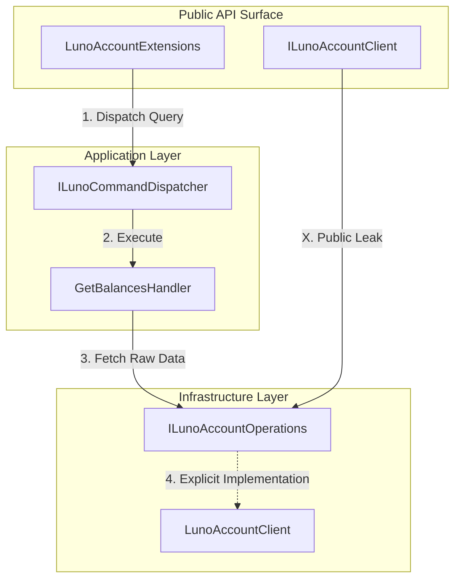

# RFC 006 Ext 03: Encapsulation and Operation Hiding

**Status:** Draft 📝  
**Date:** 2026-03-27  
**Author(s):** Gemini CLI  
**Base RFC:** [RFC 006: Trading Client and Order Lifecycle Management](./RFC006_TradingClientAndLimitOrderPlacement.md)

## 1. Executive Summary: The Vision & The Value
- **The What & The Why:** This RFC mandates the explicit separation of public Client interfaces from internal Operation interfaces. By breaking the inheritance relationship between `ILunoAccountClient` and `ILunoAccountOperations`, we eliminate the "Public Operation Leak" that currently allows users to bypass Application-layer orchestration and validation.
- **Business & System ROI:** This change hardens the system against accidental misuse and ensures that 100% of public traffic flows through the Command Dispatcher and its associated pipeline behaviors (Telemetry, Logging, Validation).
- **The Future State:** The public SDK surface area is restricted to High-Level Orchestration (Commands/Queries), while raw API access is encapsulated and restricted to internal Handlers.

## 2. The Status Quo & The Timebombs
- **The Urgency (Why Now?):** Currently, `ILunoAccountClient` (and likely others) inherits from its corresponding `Operations` interface. This means methods like `FetchBalancesAsync` (intended for internal handler use) are publicly exposed on the client, creating a "Backdoor" that bypasses all Application-layer logic.
- **The Timebombs (Assumptions):** 
    - **Security Assumption**: Assuming that users will "just use the extensions." If a user calls the client method directly, they bypass validation (e.g., the Explicit Account Mandate).
    - **Leaky Abstraction**: Assuming that the low-level data-fetching contract is the same as the public feature contract.

## 3. Goals & The Scope Creep Shield
- **Goals:**
    - **Break Inheritance**: Remove `ILunoAccountOperations` from the inheritance list of `ILunoAccountClient`.
    - **Enforce Orchestration**: Ensure `ILunoAccountClient` only exposes the `Commands` dispatcher to the public.
    - **Internal Visibility**: Use explicit interface implementation in the concrete `LunoAccountClient` to keep raw operations available to handlers while hidden from the public API.
- **Non-Goals (The Shield):**
    - This RFC does NOT change the implementation of the raw API calls.
    - This RFC does NOT change the existing Application-layer handlers.

## 4. Proposed Technical Design
### 4.1 Architecture & Boundaries
> *Note: Code is temporary; boundaries are forever.*

### 4.2 Public Contracts & Schema Mutations
- **ILunoAccountClient**: Modified to remove inheritance from `ILunoAccountOperations`.
- **LunoAccountClient**: Updated to implement `ILunoAccountOperations` explicitly.
- **Internalization**: All `*Operations` interfaces (e.g., `ILunoAccountOperations`) will be marked as `internal` to ensure they are hidden from the NuGet public surface area.

### 4.3 InternalsVisibleTo Alignment (The Visibility Trust)
To support strict encapsulation while allowing cross-project orchestration (Application Handlers calling Core Operations), the following `InternalsVisibleTo` attributes must be configured:

| Project | Visible To | Rationale |
| :--- | :--- | :--- |
| **Luno.SDK.Core** | `Application`, `Infrastructure`, `Tests.*`, `Moq` | Allows Handlers and Clients to access `internal` Operation contracts. Prevents recursion by "blinding" Handlers to the Public Dispatcher. |
| **Luno.SDK.Application** | `Tests.*`, `Moq` | Allows Unit Tests to verify `internal` mapping extensions and orchestration logic. |
| **Luno.SDK.Infrastructure**| `Tests.*`, `Moq` | (Existing) Allows verification of raw API translation logic. |

This alignment ensures that "internal" means "Internal to the SDK," enforcing the **Staff Only** boundary at the compiler level.

## 5. Execution, Rollout, & The Sunset
- **Phase 1: Foundation (The Split)**
    - Modify `ILunoAccountClient` to remove `ILunoAccountOperations` inheritance.
    - Update `LunoAccountClient` to implement `FetchBalancesAsync` explicitly.
- **Phase 2: Global Alignment**
    - Audit `Trading` and `Market` clients for similar inheritance leaks and apply the same split.
- **Phase X: The Sunset**
    - Verify that no external-facing documentation or examples reference `Fetch*` methods.

## 6. Behavioral Contracts
> **Verification Note**: No new automated tests are required for this RFC. The existing Tier 2 suite already covers the Happy Path, and the Chaos Path is verified via static analysis (Compiler Truth).

### 6.1 The Happy Path (Orchestrated Call)
- **Tier:** Integration
- **Given:** A valid `ILunoAccountClient` instance.
- **When:** A user calls `client.Account.GetBalancesAsync()`.
- **Then:** The call is routed through the `LunoCommandDispatcher` to the `GetBalancesHandler`.
- **Verification:** **Existing Integration Tests** (e.g., `LunoAccountClientTests.cs`) verify the network call and handler-level trace.

### 6.2 The Chaos Path (Bypassing Orchestration)
- **Tier:** Unit (Compiler Check)
- **Given:** A standard developer workspace.
- **When:** A developer attempts to call `client.Account.FetchBalancesAsync()`.
- **Then:** The code fails to compile.
- **Verification:** **Compiler Check**. This can be verified manually or via a throwaway script attempting to compile an invalid call. The absence of the method from the public interface is the "Machine Truth."

## 7. Operational Reality
- **Blast Radius:** **Medium (Breaking Change)**. Any user relying on the raw `Fetch*` methods instead of the fluent extensions will experience breaking compilation errors.
- **Observability:** Telemetry remains intact as handlers (who emit the traces) still use the `Operations` interface.

## 8. Disaster Recovery & The Panic Button
- **The "Panic Button":** Restore inheritance in `ILunoAccountClient`.
- **Data Safety:** No data impact; this is a pure contract refactoring.

## 9. The Pre-Mortem & Trade-offs
- **Rejected Options:** Keeping inheritance but using `[EditorBrowsable(Never)]`. Rejected because it only hides the method from IntelliSense, not from the actual public contract.
- **The Pre-Mortem:** If this RFC fails, it’s because we created a "Circular Dependency Hell" where handlers cannot access the operations they need. We mitigate this by ensuring handlers are injected with the specialized `Operations` interface, not the high-level `Client`.

## 10. Definition of Done
- **Verification Strategy:** 100% pass on all existing integration tests (which use extensions). Manual verification that `FetchBalancesAsync` is not visible on `ILunoAccountClient`.
- **TDD Mandate:** All behavioral contracts in Section 6 are verified via the compiler and existing Tier 2 suites.
