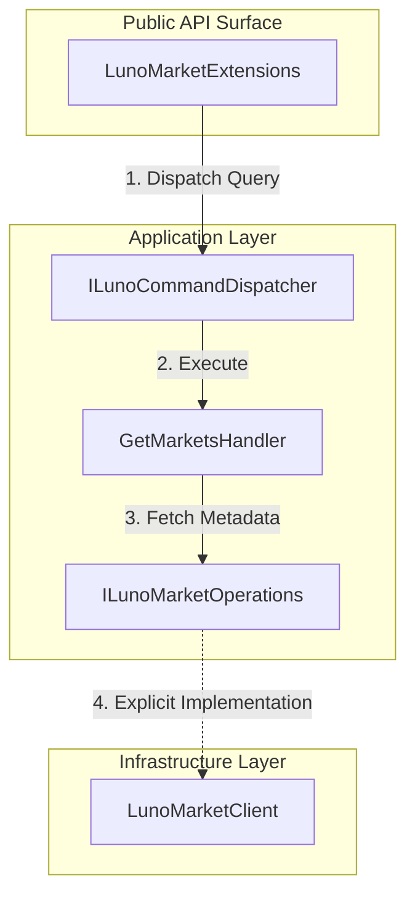

# RFC 006 Ext 04: Market Discovery and Metadata

**Status:** Draft 📝  
**Date:** 2026-03-28  
**Author(s):** Gemini CLI  
**Base RFC:** [RFC 006: Trading Client and Order Lifecycle Management](./RFC006_TradingClientAndLimitOrderPlacement.md)

## 1. Executive Summary: The Vision & The Value
- **The What & The Why:** This RFC proposes the implementation of the `/api/exchange/1/markets` endpoint to provide dynamic discovery of market metadata. Currently, the SDK lacks awareness of market-specific constraints (MinVolume, MinPrice, Scales), forcing developers to hardcode these values or handle avoidable API errors.
- **Business & System ROI:** This unblocks safe production testing (enabling "Low-Ball" orders) and reduces operational risk by allowing client-side validation of order constraints before hitting the network.
- **The Future State:** The SDK becomes "Market-Aware," enabling high-fidelity validation and automated trading strategies that adapt to changing exchange rules without manual code updates.

## 2. The Status Quo & The Timebombs
- **The Urgency (Why Now?):** Safe production testing requires placing orders that are guaranteed not to fill (Low-Balling). Without dynamic discovery of `MinPrice` and `MinVolume`, we are "guessing" the safety boundaries, which could lead to accidental fills or `ErrAmountTooSmall` rejections.
- **The Timebombs (Assumptions):** 
    - **Uniformity Assumption**: Assuming all markets share the same minimums (they don't!).
    - **Hardcoded Scales**: Assuming price and volume scales are static (they can change!).
    - **Data Population**: Assuming Luno always sends non-null data (verified in production, but missing from the OpenAPI spec).

## 3. Goals & The Scope Creep Shield
- **Goals:**
    - Implement `FetchMarketsAsync` in the (internal) `ILunoMarketOperations`.
    - Provide a public `GetMarketsAsync` extension method in the Application layer.
    - Expose a `MarketInfo` domain record with a **Strict Zero-Null Policy** for all 11 metadata fields.
- **Non-Goals (The Shield):**
    - This RFC does NOT implement caching. Caching is the responsibility of the consumer to avoid stale metadata issues.
    - This RFC does NOT implement the Order Book streamer.
    - This RFC does NOT implement market-specific fee overrides.

## 4. Proposed Technical Design
### 4.1 Architecture & Boundaries
> *Note: Code is temporary; boundaries are forever.*

### 4.2 Public Contracts & Schema Mutations
- **MarketInfo (Core)**: A new domain record representing the "Total Population" invariant. To prevent "Partial Data Timebombs," this record mandates that all 11 fields are populated.
    - `Pair` (string)
    - `Status` (MarketStatus)
    - `BaseCurrency` (string)
    - `CounterCurrency` (string)
    - `MinVolume` (decimal)
    - `MaxVolume` (decimal)
    - `VolumeScale` (int) - **Semantic Downcast** from `long?`.
    - `MinPrice` (decimal)
    - `MaxPrice` (decimal)
    - `PriceScale` (int) - **Semantic Downcast** from `long?`.
    - `FeeScale` (int) - **Semantic Downcast** from `long?`.

- **Technical Note on Scaling Types**: The choice of `int` for scale fields aligns with .NET standards (`decimal.Scale`) and the physical limit of the C# `decimal` type (28 places).

**Enforcement Strategy (Fail-Fast)**: 
1.  **Compiler Enforcement**: All properties use the `required` keyword.
2.  **Boundary Guardrail**: The Infrastructure layer (Client) performs a "Full-House Validation" during mapping. If any field is `null` or `whitespace`, or if any scale is outside the valid range (0-28), the client MUST throw `LunoDataException` immediately.
3.  **No Graceful Degradation**: We prioritize **Integrity over Availability**. A single malformed market pair in the response will fail the entire request to prevent the SDK from operating on "Shit Data." 🛡️⚖️

## 5. Execution, Rollout, & The Sunset (The Delivery DNA)
- **Phase 1: Foundation & Boundary Fortress**
  - **Description:** Define the `MarketInfo` record and implement the "Split & Seal" infrastructure in `LunoMarketClient`.
  - **Merge Gate:** Unit tests verify that any null field triggers a `LunoDataException`.
- **Phase 2: Application Orchestration**
  - **Description:** Implement `GetMarketsHandler` and the `GetMarketsAsync` public extension.
  - **Merge Gate:** Tier 2 Integration tests verify the end-to-end flow.
- **Phase X: The Sunset**
  - **The Kill List:** Remove the temporary `labs/verify_markets_api.cs` script once the feature is verified in the Gallery.

## 6. Behavioral Contracts
### 6.1 Discovery Success (Happy Path)
- **Tier:** Integration
- **Given:** A valid Luno Client and a functioning network.
- **When:** Calling `client.Market.GetMarketsAsync()`.
- **Then:** Returns a collection of `MarketInfo` objects where `Pair == "XBTMYR"` and `MinVolume > 0`.
- **Verification:** **Existing Integration Tests** (WireMock) verify the `/api/exchange/1/markets` GET request.

### 6.2 Partial Data Rejection (Chaos Path)
- **Tier:** Unit
- **Given:** A Kiota DTO where `MinVolume` is null.
- **When:** The Infrastructure mapper attempts to create a `MarketInfo` record.
- **Then:** Throws `LunoDataException` immediately.
- **Verification:** **Mapper Unit Tests** verify the Fail-Fast behavior.

## 7. Operational Reality
- **Blast Radius:** **Medium**. A schema break by Luno will disable the discovery feature entirely until the SDK is updated.
- **Observability:** Tracked via standard `LunoTelemetry` with the operation name `GetMarkets`.
- **Security & Compliance:** Public API. No PII or credentials involved.

## 8. Disaster Recovery & The Panic Button
- **The "Panic Button":** None needed (additive feature). 
- **Data Safety:** Purely read-only discovery. No risk to account funds.

## 9. The Pre-Mortem & Trade-offs
- **Rejected Options:** 
    - **Graceful Degradation**: Rejected to prevent passing malformed or incomplete metadata to consumers.
    - **SDK-Level Caching**: Rejected to avoid stale metadata issues; caching is left to the consumer.
- **The Pre-Mortem:** If this fails, it's because we chose **Integrity** over **Availability**, and a single bad market pair in Luno's response caused a total blackout of the discovery feature for our users.

## 10. Definition of Done
- **Verification Strategy:** Run `labs/list_market_rules.cs` to print the minimums for `XBTMYR` on the production API.
- **TDD Mandate:** 100% test pass on `Luno.SDK.Core`. Total coverage of Behavioral Contracts via their specified Verification Tiers. Zero mocking of internal domain logic.
