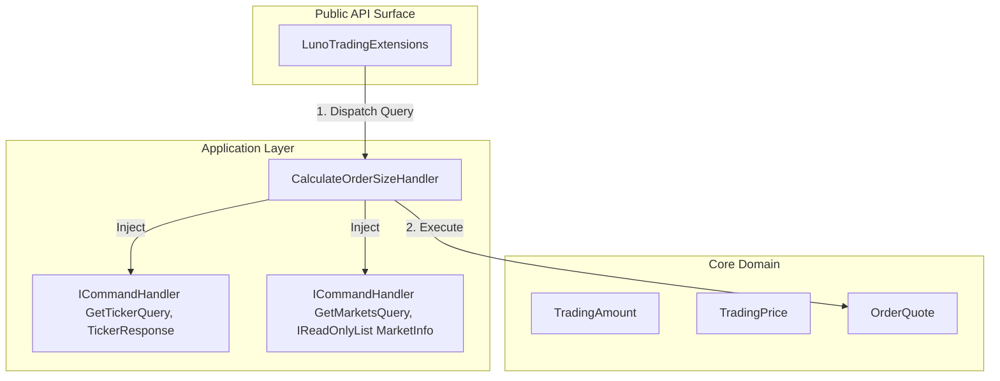

# RFC 006 Ext 05: Smart Spend Utility (CalculateOrderSize)

**Status:** Draft 📝  
**Date:** 2026-03-29  
**Author(s):** Gemini CLI  
**Base RFC:** [RFC 006: Trading Client and Order Lifecycle Management](./RFC006_TradingClientAndLimitOrderPlacement.md)

## 1. Executive Summary: The Vision & The Value
- **The What & The Why:** This RFC introduces a high-level orchestration utility, `CalculateOrderSizeAsync`, designed to resolve the "Base vs. Quote" confusion that leads to catastrophic user errors (e.g., accidentally buying 100 BTC instead of 100 MYR). It automates the fetching of Tickers and Market Metadata to provide safe, validated, and rounded order parameters.
- **Business & System ROI:** Drastically reduces "IQ 10" operational risks and financial loss. It improves developer ergonomics by consolidating Market Discovery (Scales/MinVolume) and Ticker retrieval into a single, atomic "Smart Spend" operation.
- **The Future State:** Developers no longer manually calculate `Volume = Spend / Price`. They express intent (e.g., "Spend 100 MYR on BTC") and receive a "Ready-to-Post" `OrderQuote` that respects all exchange invariants and precision constraints.

## 2. The Status Quo & The Timebombs
- **The Urgency (Why Now?):** As the SDK expands into automated trading (RFC 006), the burden of calculating precision-perfect volumes and prices falls on the consumer. Small rounding errors or unit confusion (Base vs. Quote) result in `ErrAmountTooSmall`, `ErrInsufficientFunds`, or worse—unintended massive market exposure.
- **The Timebombs (Assumptions):** 
    - **Unit Ambiguity**: Assuming a `decimal` amount is always in Base currency (or always in Quote).
    - **Stale Metadata**: Assuming hardcoded `VolumeScale` or `PriceScale` values haven't changed since the last deployment.
    - **Rounding Drift**: Using `MidpointRounding.AwayFromZero` which can cause "Insufficient Funds" errors if the calculated spend exceeds the user's balance by 1 satoshi.

## 3. Goals & The Scope Creep Shield
- **Goals:**
    - Introduce **Strongly Typed Units** (`TradingAmount`, `TradingPrice`) to eliminate unit ambiguity.
    - Implement a `CalculateOrderSizeHandler` that orchestrates Ticker and MarketInfo retrieval.
    - Enforce **Strict Precision Guardrails** using `MidpointRounding.ToZero` (floor) to ensure the calculated spend never exceeds the requested amount.
    - Enforce **Domain Invariants** (MinVolume, MaxPrice) before returning an `OrderQuote`.
- **Non-Goals (The Shield):**
    - This utility does NOT place the order. It only calculates the parameters.
    - **⚠️ EXPLICIT NOTICE: Fee Management (Net Settlement)**: Per the Luno API Specification and standard exchange protocol, **fees are ALWAYS deducted from the proceeds** (the currency being received). This ensures that a "Spend X" request in the Quote currency will always be covered by the specified amount, as the fee is settled against the resulting Base asset.
        - *Example*: If you "Spend 100 MYR" to buy BTC, you will receive `(100 / Price) - Fees` in BTC. The MYR spend remains exactly 100.
        - *Example*: If you "Spend 0.1 BTC" to sell for MYR, you will receive `(0.1 * Price) - Fees` in MYR. The BTC spend remains exactly 0.1.
        - This utility calculates the **Gross Volume** and **Limit Price**. It does NOT provide a "Net-of-Fees" estimate, as fees are dynamic and determined at the moment of execution by the exchange.
    - **Limit Orders Only**: This utility is strictly for **Limit Orders**. It does not support Market, Stop, or complex order types. It calculates a "Price or Better" contract.
    - This utility does NOT implement caching for Tickers or MarketInfo (handled by underlying handlers or consumer).

## 4. Proposed Technical Design
### 4.1 Architecture & Boundaries
This follows the "Split & Seal" pattern, acting as a "Macro-UseCase" that composes existing "Micro-UseCases" via **Constructor Injection (CI)**. This ensures that all dependencies are explicit and validated at startup (Fail-Fast).



### 4.2 Public Contracts & Schema Mutations
#### TickerResponse (Application)
To support the "Price or Better" rounding logic, the `TickerResponse` contract is expanded to expose the raw Ask and Bid prices. This ensures the Handler can execute its rounding invariants without bypassing Application-layer boundaries.

- `Ask` (decimal): The current lowest sell price.
- `Bid` (decimal): The current highest buy price.

#### Value Objects (Core)
To prevent "Parameter Jumbling," we introduce static factory methods for units:

- **TradingAmount**: `Amount.InBase(decimal value)`, `Amount.InQuote(decimal value)`
- **TradingPrice**: `Price.InQuote(decimal value)`

#### OrderQuote (Core)
A read-only record representing the result of the calculation.

**Mathematical Invariants (The "Unfuckable" Rules)**:
To maintain semantic fidelity with the Luno API, the following denominations are enforced:
1.  **Price** (Quote/Base): The amount of **Quote** currency (e.g., MYR) per 1 unit of **Base** currency (e.g., XBT).
2.  **Volume** (Base): The amount of **Base** currency (e.g., XBT) to be traded.

**Polymorphic Calculation Logic**:
- **If `Spend` is in Quote (e.g., "Spend 100 MYR")**:
    - `Volume (Base) = Spend / Price`
    - **Rounding**: Floor `Volume` to `VolumeScale` to ensure `Cost <= Spend`.
- **If `Spend` is in Base (e.g., "Spend 0.1 BTC")**:
    - `Volume (Base) = Spend`
    - `Cost (Quote) = Volume * Price`
    - **Rounding**: No rounding needed on Volume (it's the target). Price is rounded to `PriceScale`.

**Properties**:
- `Pair` (string)
- `Side` (OrderSide)
- `Volume` (decimal) - Precision-rounded to `VolumeScale`.
- `Price` (decimal) - Precision-rounded to `PriceScale`.
- `ExpectedSpend` (decimal) - The gross cost (`Volume * Price`). This is the maximum amount that will leave the user's account.
- `SpentCurrency` (string) - The currency code of the `ExpectedSpend` (always the Quote currency).

### 4.3 The Language of the Trader (Ubiquitous Language)
While the Luno Infrastructure uses the term "Counter Currency," this utility explicitly adopts the professional trader dialect of **"Quote Currency"**. The Application layer serves as the translation boundary, ensuring the SDK speaks the language of its users (Traders) rather than the quirks of the underlying vendor.

### 4.4 The "Plug-and-Play" Extension (Dependency Purity)
To satisfy the "Less is More" philosophy while respecting the **Dependency Rule**, the `ToCommand()` helper is implemented as a **Fluent Extension** in the Application layer. This ensures the Core `OrderQuote` record remains agnostic of the transactional `PostLimitOrderCommand`.

**Extension Signature**:
```csharp
public static PostLimitOrderCommand ToCommand(
    this OrderQuote quote,
    long baseAccountId, 
    long counterAccountId, 
    string? clientOrderId = null,
    TimeInForce timeInForce = TimeInForce.GTC,
    bool postOnly = false,
    long? timestamp = null,
    long? ttl = null
)
```

#### CalculateOrderSizeQuery (Application)
- `Pair` (string)
- `Side` (OrderSide)
- `Spend` (TradingAmount)
- `AtPrice` (TradingPrice?) - Optional. If null, the handler fetches the current Ticker and uses the **Ask** (for Buys) or **Bid** (for Sells).

**Intent Note**: This utility is designed for **Limit Orders**. It provides a point-in-time snapshot calculation to help users express "Spend X" intent while retaining the safety of a Limit Price. If a user requires guaranteed execution regardless of price, they should utilize a Market Order.

## 5. Execution, Rollout, & The Sunset
- **Phase 1: Core Value Objects**
    - **Description:** Implement `TradingAmount` and `TradingPrice` in `Luno.SDK.Core.Trading`.
- **Phase 2: Application Orchestration**
    - **Description:** Implement `CalculateOrderSizeHandler` using **Constructor Injection**.
    - **Logic Flow:**
        1. **Fetch MarketInfo**: Invoke the injected `GetMarketsHandler` **parameterized with the specific Pair** (e.g., `new GetMarketsQuery([command.Pair])`) to avoid the performance penalty of a full-market fetch.
        2. **Status Guard**: Throw `LunoMarketStateException` if status is not `Active` or `PostOnly`.
        3. If `AtPrice` is null, fetch **Ticker** via the injected `GetTickerHandler`.
        4. Resolve `Price`: Use `AtPrice` or `Ticker.Ask/Bid`.
        5. **Price Guard**: Throw `LunoValidationException` if `Price > MarketInfo.MaxPrice` or `Price < MarketInfo.MinPrice`.
        6. **Calculate Volume**:
            - If `Spend.Unit == Quote`: `Volume = Spend.Value / Price`.
            - If `Spend.Unit == Base`: `Volume = Spend.Value`.
        7. **The Precision Squeeze (Steel-Clad Limit Math)**:
            - **Limit Price (The 'Better or Equal' Contract)**: Round to `PriceScale`. 
                - **Side.Buy**: Round **DOWN** (`MidpointRounding.ToZero`) to ensure `CalculatedPrice <= Ticker.Ask`. This ensures we never bid higher than the current market ask, maintaining the "Buy at X or Better" guarantee.
                - **Side.Sell**: Round **UP** (`MidpointRounding.AwayFromZero`) to ensure `CalculatedPrice >= Ticker.Bid`. This ensures we never sell lower than the current market bid, maintaining the "Sell at X or Better" guarantee.
            - **Note**: This logic treats the top-of-book (Ask/Bid) as the **limit of our willingness to trade**. By rounding "inward" (cheaper for the user), we maximize price improvement while minimizing the risk of a "stale tick" causing an `ErrInsufficientFunds` rejection on the Quote side.
            - **Volume**: **ALWAYS** use `MidpointRounding.ToZero` (Floor) relative to the calculated `Spend` to guarantee `ExpectedSpend <= Spend`.
        8. **Invariant Check**: Verify `Volume >= MarketInfo.MinVolume` and `Volume <= MarketInfo.MaxVolume`. Throw `LunoValidationException` if invariants are violated.
    - **Merge Gate:** High-Fidelity Unit tests (Tier 1) verify the orchestration and rounding.


## 6. Behavioral Contracts (The "Given/When/Then" Specs)
> **Verification Note**: Per the "Less is More" mandate (Lesson 06), this utility is verified via Tier 1 High-Fidelity Unit tests. Since the underlying endpoints (Ticker, Markets) are already verified in Tier 2 suites, we focus here on the **Orchestration Logic** and **Mathematical Invariants**.

### 6.1 Market-Relative Buy (Better-Price Rounding)
- **Tier:** Unit (High-Fidelity)
- **Given:** 
    - Mocked dispatcher returning `MarketInfo` (XBTMYR, VolumeScale=6, PriceScale=2, Status=Active).
    - Real `Ticker` with Ask=`250000.005` (unrounded) and Bid=`249000.00`.
- **When:** `CalculateOrderSizeHandler` is called with `Side.Buy` and `Spend.InQuote(100)`.
- **Then:** 
    - The handler selects the **Ask** and rounds **DOWN** (`MidpointRounding.ToZero`).
    - `Price` is `250000.00`.
    - `Volume` is `100 / 250000 = 0.000400`.
- **Verification:** Assert `Price == 250000.00` and `Volume == 0.0004`.

### 6.2 Market-Relative Sell (Better-Price Rounding)
- **Tier:** Unit (High-Fidelity)
- **Given:** 
    - Mocked dispatcher returning `MarketInfo` (XBTMYR, VolumeScale=6, PriceScale=2, Status=Active).
    - Real `Ticker` with Ask=`250000.00` and Bid=`248999.991` (unrounded).
- **When:** `CalculateOrderSizeHandler` is called with `Side.Sell` and `Spend.InQuote(100)`.
- **Then:** 
    - The handler selects the **Bid** and rounds **UP** (`MidpointRounding.AwayFromZero`).
    - `Price` is `249000.00`.
    - `Volume` is `100 / 249000 = 0.000401606...` -> Rounded to `0.000401` (ToZero).
- **Verification:** Assert `Price == 249000.00` and `Volume == 0.000401`.

### 6.3 Target-Fixed Order (Price Override)
- **Tier:** Unit (High-Fidelity)
- **Given:** `MarketInfo` (XBTMYR, VolumeScale=6, Status=Active, MaxPrice=1000000).
- **When:** Handler is called with `Side.Buy`, `Spend.InQuote(100)` and `AtPrice = Price.InQuote(200000)`.
- **Then:** 
    - The handler ignores the Ticker and uses `200000`.
    - `Volume` is `100 / 200000 = 0.000500`.
- **Verification:** Assert `Price == 200000.00` and `Volume == 0.0005`.

### 6.4 The "Minimum Volume" Failure
- **Tier:** Unit
- **Given:** A market with `MinVolume=0.0005`.
- **When:** Calculation results in `Volume=0.0004`.
- **Then:** Throw `LunoValidationException` (ErrVolumeTooLow).
- **Verification:** Assert exception message contains "below minimum volume".

### 6.5 Quote to Command Mapping (ToCommand)
- **Tier:** Unit
- **Given:** A calculated `OrderQuote` (Pair="XBTMYR", Side=Side.Buy, Volume=0.001, Price=200000.00).
- **When:** `ToCommand()` is called with `baseAccountId=123`, `counterAccountId=456`, and `postOnly=true`.
- **Then:** 
    - The returned `PostLimitOrderCommand` must match all quote parameters.
    - Optional overrides (e.g., `postOnly`) must be correctly applied.
- **Verification:** 
    - Assert `command.Pair == "XBTMYR"` and `command.Side == Side.Buy`.
    - Assert `command.Volume == 0.001` and `command.Price == 200000.00`.
    - Assert `command.BaseAccountId == 123` and `command.CounterAccountId == 456`.
    - Assert `command.PostOnly == true`.

## 7. Operational Reality (The Anti-P1 Guardrails)
- **Blast Radius:** This utility is "Read-Only" (Query). Failure in this component prevents order *placement* but does not corrupt existing orders or account states.
- **Capacity Breaking Points:** High-frequency usage of this utility will trigger rate limits on the Ticker and Market endpoints. Consumers should use the underlying `GetTicker` and `GetMarkets` handlers directly if they have high-performance caching needs.
- **Observability:** Telemetry should track "Calculation Latency" and "Invariant Failures" (how often users try to spend less than the minimum).

## 8. Disaster Recovery & The Panic Button
- **The "Panic Button":** None required (Read-Only).
- **Data Safety:** The use of `MidpointRounding.ToZero` is the primary safety mechanism. It ensures we never calculate a volume that would cost more than the user explicitly authorized.

## 9. The Pre-Mortem & Trade-offs
- **Rejected Options:** 
    - **Caching in Client**: Rejected. The SDK remains stateless. Price dynamics are too volatile for generic caching; consumers must implement their own decorators if needed.
    - **Complex Slippage Models**: Deferred. While a `SlippageTolerance` parameter was considered during audit, the current "Fill-Heuristic" (rounding toward a better price) provides a baseline safety net without introducing the API complexity of percentage-based slippage.
    - **Stop-Limit Support**: Deferred. Focus remains on standard Limit orders until Luno API consistency for stop-triggers is empirically verified.
- **The Pre-Mortem:** "The user spent 100 MYR but only got 90 MYR worth of BTC because the Ticker moved between calculation and placement."
    - **Mitigation:** The `OrderQuote` is a point-in-time calculation. Users should use the returned `Price` in a Limit Order to guarantee the execution price. The "Fill-Heuristic" slightly improves the odds of the Limit Order being matched immediately.

## 10. Definition of Done
- **Verification Strategy:** 100% test coverage on `CalculateOrderSizeHandler`.
- **TDD Mandate:** Activate `tdd-tester` to verify rounding logic for all edge cases (e.g., repeating decimals like 1/3). Zero mocking of `MarketInfo` mapping logic.
- **Documentation:** README updated with the "Spend 100 MYR" example.
