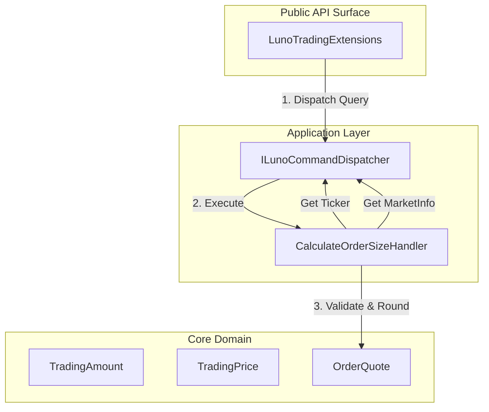

# RFC 006 Ext 05: Smart Spend Utility (CalculateOrderSize)

**Status:** Draft 📝  
**Date:** 2026-03-29  
**Author(s):** Gemini CLI  
**Base RFC:** [RFC 006: Trading Client and Order Lifecycle Management](./RFC006_TradingClientAndLimitOrderPlacement.md)

## 1. Executive Summary: The Vision & The Value
- **The What & The Why:** This RFC introduces a high-level orchestration utility, `CalculateOrderSizeAsync`, designed to resolve the "Base vs. Quote" confusion that leads to catastrophic user errors (e.g., accidentally buying 100 BTC instead of 100 MYR). It automates the fetching of Tickers and Market Metadata to provide safe, validated, and rounded order parameters.
- **Business & System ROI:** Drastically reduces "IQ 10" operational risks and financial loss. It improves developer ergonomics by consolidating Market Discovery (Scales/MinVolume) and Ticker retrieval into a single, atomic "Smart Spend" operation.
- **The Future State:** Developers no longer manually calculate `Volume = Spend / Price`. They express intent (e.g., "Spend 100 MYR on BTC") and receive a "Ready-to-Post" `OrderQuote` that respects all exchange invariants and precision constraints.

## 2. The Status Quo & The Timebombs
- **The Urgency (Why Now?):** As the SDK expands into automated trading (RFC 006), the burden of calculating precision-perfect volumes and prices falls on the consumer. Small rounding errors or unit confusion (Base vs. Quote) result in `ErrAmountTooSmall`, `ErrInsufficientFunds`, or worse—unintended massive market exposure.
- **The Timebombs (Assumptions):** 
    - **Unit Ambiguity**: Assuming a `decimal` amount is always in Base currency (or always in Quote).
    - **Stale Metadata**: Assuming hardcoded `VolumeScale` or `PriceScale` values haven't changed since the last deployment.
    - **Rounding Drift**: Using `MidpointRounding.AwayFromZero` which can cause "Insufficient Funds" errors if the calculated spend exceeds the user's balance by 1 satoshi.

## 3. Goals & The Scope Creep Shield
- **Goals:**
    - Introduce **Strongly Typed Units** (`TradingAmount`, `TradingPrice`) to eliminate unit ambiguity.
    - Implement a `CalculateOrderSizeHandler` that orchestrates Ticker and MarketInfo retrieval.
    - Enforce **Strict Precision Guardrails** using `MidpointRounding.ToZero` (floor) to ensure the calculated spend never exceeds the requested amount.
    - Enforce **Domain Invariants** (MinVolume, MaxPrice) before returning an `OrderQuote`.
- **Non-Goals (The Shield):**
    - This utility does NOT place the order. It only calculates the parameters.
    - This utility does NOT handle fee calculations (Maker/Taker). It calculates the gross spend.
    - This utility does NOT implement caching for Tickers or MarketInfo (handled by underlying handlers or consumer).

## 4. Proposed Technical Design
### 4.1 Architecture & Boundaries
This follows the "Split & Seal" pattern, acting as a "Macro-UseCase" that composes existing "Micro-UseCases" (GetTicker, GetMarkets).



### 4.2 Public Contracts & Schema Mutations
#### Value Objects (Core)
To prevent "Parameter Jumbling," we introduce static factory methods for units:

- **TradingAmount**:
    - `Amount.InBase(decimal value)`
    - `Amount.InQuote(decimal value)`
- **TradingPrice**:
    - `Price.InQuote(decimal value)`
    - `Price.Market()` (Placeholder for future Market Order support, though this RFC focuses on Limit/Quote generation).

#### OrderQuote (Core)
A read-only record representing the result of the calculation.

**Mathematical Invariants (The "Unfuckable" Rules)**:
To maintain semantic fidelity with the Luno API, the following denominations are enforced:
1.  **Price** (Quote/Base): The amount of **Quote** currency (e.g., MYR) per 1 unit of **Base** currency (e.g., XBT).
2.  **Volume** (Base): The amount of **Base** currency (e.g., XBT) to be traded.
3.  **TotalSpend** (Quote): The total value of the trade in **Quote** currency, calculated as `Volume * Price`.

**Formula**: `Volume (Base) = Spend (Quote) / Price (Quote/Base)`

- `Pair` (string)
- `Side` (OrderSide)
- `Volume` (decimal) - Precision-rounded to `VolumeScale`.
- `Price` (decimal) - Precision-rounded to `PriceScale`.
- `TotalSpend` (decimal) - `Volume * Price`. Guaranteed <= requested Spend (if Spend was in Quote).

**The "Plug-and-Play" Guarantee**:
To satisfy the "Less is More" philosophy and protect users from the "Dumbass Design" of the raw API, the `OrderQuote` will provide a `ToCommand()` helper. This helper maps the calculated `Volume` and `Price` directly into a `PostLimitOrderCommand`.

**Helper Signature**:
```csharp
public PostLimitOrderCommand ToCommand(
    long baseAccountId, 
    long counterAccountId, 
    string? clientOrderId = null,
    TimeInForce timeInForce = TimeInForce.GTC,
    bool postOnly = false,
    long? timestamp = null,
    long? ttl = null
)
```
This ensures the request is "Validated-by-Construction" while allowing the developer to provide the necessary orchestration metadata (Accounts, Idempotency) that are outside the scope of mathematical calculation.

#### CalculateOrderSizeQuery (Application)
- `Pair` (string)
- `Side` (OrderSide)
- `Spend` (TradingAmount)
- `AtPrice` (TradingPrice?) - Optional. If null, the handler fetches the current Ticker and uses the **Ask** (for Buys) or **Bid** (for Sells).

## 5. Execution, Rollout, & The Sunset
- **Phase 1: Core Value Objects**
    - **Description:** Implement `TradingAmount` and `TradingPrice` in `Luno.SDK.Core.Trading`.
    - **Merge Gate:** Unit tests verify that `InBase` and `InQuote` instances are distinguishable and immutable.
- **Phase 2: Application Orchestration**
    - **Description:** Implement `CalculateOrderSizeHandler`.
    - **Logic Flow:**
        1. Fetch `MarketInfo` via `GetMarketsQuery`. Find the specific `Pair`.
        2. If `AtPrice` is null, fetch `Ticker` via `GetTickerQuery`.
        3. Resolve `Price`: Use `AtPrice` or `Ticker.Ask/Bid`.
        4. Calculate `Volume`:
            - If `Spend` is in Base: `Volume = Spend.Value`.
            - If `Spend` is in Quote: `Volume = Spend.Value / Price`.
        5. **The Precision Squeeze**: 
            - Round `Price` to `MarketInfo.PriceScale`.
            - Round `Volume` to `MarketInfo.VolumeScale` using `MidpointRounding.ToZero`.
        6. **Invariant Check**: Verify `Volume >= MarketInfo.MinVolume`.
    - **Merge Gate:** Integration tests with WireMock verifying the "Spend 100 MYR" flow correctly pulls Ticker/MarketInfo.

## 6. Behavioral Contracts (The "Given/When/Then" Specs)
> **Verification Note**: Per the "Less is More" mandate (Lesson 06), this utility is verified via Tier 1 High-Fidelity Unit tests. Since the underlying endpoints (Ticker, Markets) are already verified in Tier 2 suites, we focus here on the **Orchestration Logic** and **Mathematical Invariants**.

### 6.1 Market-Relative Buy (Ask Selection)
- **Tier:** Unit (High-Fidelity)
- **Given:** 
    - Mocked dispatcher returning `MarketInfo` (XBTMYR, VolumeScale=6).
    - Real `Ticker` with Ask=`250000.00` and Bid=`249000.00`.
- **When:** `CalculateOrderSizeHandler` is called with `Side.Buy` and `Spend.InQuote(100)`.
- **Then:** 
    - The handler selects the **Ask** price (`250000.00`).
    - `Volume` is `100 / 250000 = 0.000400`.
    - `TotalSpend` is exactly `100.00`.
- **Verification:** Assert `Price == 250000.00`, `Volume == 0.0004`, and `TotalSpend == 100.00`.

### 6.2 Market-Relative Sell (Bid Selection)
- **Tier:** Unit (High-Fidelity)
- **Given:** 
    - Mocked dispatcher returning `MarketInfo` (XBTMYR, VolumeScale=6).
    - Real `Ticker` with Ask=`250000.00` and Bid=`249000.00`.
- **When:** `CalculateOrderSizeHandler` is called with `Side.Sell` and `Spend.InQuote(100)`.
- **Then:** 
    - The handler selects the **Bid** price (`249000.00`).
    - `Volume` is `100 / 249000 = 0.000401606...` -> Rounded to `0.000401` (ToZero).
    - `TotalSpend` is `0.000401 * 249000 = 99.849`.
- **Verification:** Assert `Price == 249000.00`, `Volume == 0.000401`, and `TotalSpend <= 100.00`.

### 6.3 Target-Fixed Order (Price Override)
- **Tier:** Unit (High-Fidelity)
- **Given:** `MarketInfo` (XBTMYR, VolumeScale=6).
- **When:** Handler is called with `Spend.InQuote(100)` and `AtPrice = Price.InQuote(200000)`.
- **Then:** 
    - The handler ignores the Ticker and uses `200000`.
    - `Volume` is `100 / 200000 = 0.000500`.
    - `TotalSpend` is exactly `100.00`.
- **Verification:** Assert `Price == 200000.00`, `Volume == 0.0005`, and `TotalSpend == 100.00`.

### 6.4 The "Minimum Volume" Failure
- **Tier:** Unit
- **Given:** A market with `MinVolume=0.0005`.
- **When:** Calculation results in `Volume=0.0004`.
- **Then:** Throw `LunoBusinessRuleException` (or specific `LunoOrderRejectedException`).
- **Verification:** Assert exception message contains "below minimum volume".

## 7. Operational Reality (The Anti-P1 Guardrails)
- **Blast Radius:** This utility is "Read-Only" (Query). Failure in this component prevents order *placement* but does not corrupt existing orders or account states.
- **Capacity Breaking Points:** High-frequency usage of this utility will trigger rate limits on the Ticker and Market endpoints. Consumers should use the underlying `GetTicker` and `GetMarkets` handlers directly if they have high-performance caching needs.
- **Observability:** Telemetry should track "Calculation Latency" and "Invariant Failures" (how often users try to spend less than the minimum).

## 8. Disaster Recovery & The Panic Button
- **The "Panic Button":** None required (Read-Only).
- **Data Safety:** The use of `MidpointRounding.ToZero` is the primary safety mechanism. It ensures we never calculate a volume that would cost more than the user explicitly authorized.

## 9. The Pre-Mortem & Trade-offs
- **Rejected Options:** 
    - **Option A: Simple Decimal Extension**: `decimal.ToVolume(pair)`. Rejected because it lacks context (Is this decimal BTC or MYR?) and cannot easily fetch Tickers.
    - **Option B: Floating Point Math**: Rejected. All calculations MUST use `decimal` to maintain exchange-grade precision.
- **The Pre-Mortem:** "The user spent 100 MYR but only got 90 MYR worth of BTC because the Ticker moved between calculation and placement."
    - **Mitigation:** The `OrderQuote` is a point-in-time calculation. Users should apply a "Slippage Buffer" or use the returned `Price` in a Limit Order to guarantee the execution price.

## 10. Definition of Done
- **Verification Strategy:** 100% test coverage on `CalculateOrderSizeHandler`.
- **TDD Mandate:** Activate `tdd-tester` to verify rounding logic for all edge cases (e.g., repeating decimals like 1/3). Zero mocking of `MarketInfo` mapping logic.
- **Documentation:** README updated with the "Spend 100 MYR" example.
