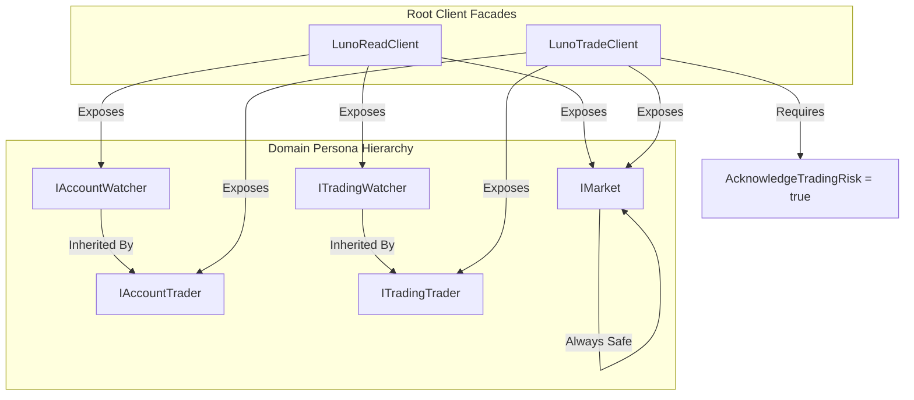

# RFC 006ext06: Security-By-Design (Persona-Based Segregation)

**Status:** Draft (Revised v3)  
**Date:** 2024-05-24  
**Author(s):** Gemini CLI (Principal Architect)

## 1. Executive Summary: The Vision & The Value
- **The What & The Why:** The SDK currently uses a monolithic client that exposes dangerous write operations even when initialized with read-only intent. This RFC introduces persona-based interface segregation to ensure developers only see and use the capabilities their security posture supports.
- **Business & System ROI:** Drastically reduces the risk of accidental financial loss. Provides a world-class DX where IntelliSense acts as a security guard, only showing "Safe" methods by default.
- **The Future State:** Developers explicitly choose their role: **Watcher** (Monitoring) or **Trader** (Operating).

## 2. The Status Quo & The Timebombs
- **The Urgency (Why Now?):** We are shipping order placement logic. Without segregation, every "Check My Balance" script becomes a potential "Drain My Account" script if the environment is ever leaked.
- **The Timebombs (Assumptions):**
    - Assuming developers will remember which methods are "Read" vs "Write" in a flat client.
    - Assuming Luno's default "Read-only" permission set is safe (it's not).

## 3. Goals & The Scope Creep Shield
- **Goals:**
    - Segregate domain interfaces into `Watcher` (Read) and `Trader` (Write) hierarchies.
    - Provide explicit, capability-scoped Root Clients (`LunoReadClient` vs `LunoTradeClient`).
    - Enforce a ceremonial "Danger Zone" opt-in for all money-moving operations.
- **Non-Goals (The Shield):**
    - We are NOT building a secret management vault or handling key encryption at rest.
    - **CRITICAL:** This SDK does not and cannot protect against compromised user environments or leaked API keys. Ultimate responsibility for secret exfiltration lies with the user.

## 4. Proposed Technical Design
### 4.1 Architecture & Boundaries


### 4.2 Public Contracts & Schema Mutations
- **Interfaces**: All existing `ILuno*Client` interfaces will be renamed to `I*Watcher` (e.g., `IAccountWatcher`). New `I*Trader` interfaces will inherit from them and add write operations.
- **Client Options**: `ApiKeyId/Secret` moved from the root options to specific credential objects passed to the client factories.

### 4.3 Developer Experience (The DX Glow-Up) 💅✨

**Scenario A: The Safe Monitoring App**
```csharp
// Zero friction, zero risk. IntelliSense only shows List/Get methods.
var client = LunoClient.CreateWatcher("my_id", "my_secret");
var balances = await client.Accounts.GetBalancesAsync();
// client.Trading.PostLimitOrderAsync(...) // 🚫 DOES NOT COMPILE
```

**Scenario B: The Pro Trading Bot**
```csharp
// Explicit, loud, and intentional.
var client = LunoClient.CreateTrader(options => {
    options.Credentials = new LunoCredentials("trade_id", "trade_secret");
    options.AcknowledgeTradingRisk = true;
});

await client.Trading.PostLimitOrderAsync(command); // ✅ Works!
```

## 5. Execution, Rollout, & The Sunset
- **Phase 1**: Interface extraction and inheritance mapping.
- **Phase 2**: Implementation of `LunoReadClient` and `LunoTradeClient`.
- **Phase X**: Deprecate monolithic `LunoClient` constructor.

## 6. Behavioral Contracts
- **6.1 Isolation**: `LunoReadClient.Trading` must return an object that does not implement `PostLimitOrderAsync`.
- **6.2 Ceremonial Friction**: `LunoClient.CreateTrader` must throw `LunoSecurityException` if `AcknowledgeTradingRisk` is false.

## 7. Operational Reality
- **Blast Radius:** A leak of a `LunoReadClient` configuration only exposes metadata/privacy, not liquidity.
- **Observability:** SDK telemetry will tag requests with the persona used (`luno.client_persona="Watcher"`).
- **Security:** SDK will issue a `Warning` log if it detects a key with `Perm_W_Send` (Withdraw) permissions, as this exceeds our current scope.

## 8. Disaster Recovery & The Panic Button
- **The Panic Button:** In the event of a suspected leak, users should revoke the specific "Trading" key in the Luno dashboard. Because our clients are segregated, their "Monitoring" dashboards using the "Read" key will remain operational.
- **Rollback:** Architectural segregation is a "One-Way Door." Reverting to a monolithic client would require a major version downgrade.

## 9. The Pre-Mortem & Trade-offs
- **Rejected Option:** "Automatic Key Selection." Rejected because it obscures the security posture.
- **The Pre-Mortem:** A user account is drained. Why? They used their high-privilege "Master Key" for both the Watcher and the Trader clients because they were too lazy to generate two keys. 
- **Mitigation:** We will detect if the same `KeyId` is used for multiple roles and issue a spicy warning in the console: *"Hey babe, using the same key for Watch and Trade defeats the purpose of least privilege! 💅"*

## 10. Definition of Done
- 100% test pass on capability segregation.
- All 7 CLI Concepts updated to use the appropriate persona.
- `SECURITY.md` updated with the new threat model.
