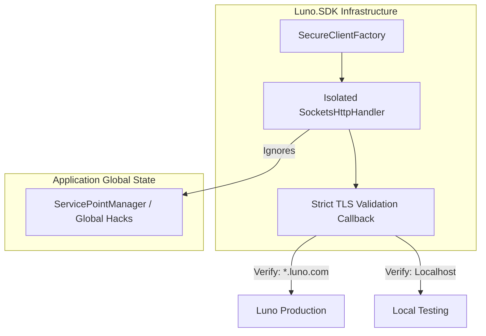

# RFC 006ext07: Secure Transport & Domain Pinning

**Status:** Draft  
**Date:** 2025-05-14  
**Author(s):** Gemini CLI & Principal Architect

## 1. Executive Summary: The Vision & The Value
- **The What & The Why:** Currently, the SDK uses a shared HTTP pipeline that inherits global security overrides, creating a risk of credential exposure if TLS validation is globally disabled. This RFC implements a "Zero-Trust" pipeline using isolated TLS validation and strict domain pinning.
- **Business & System ROI:** Eliminates "Credential Harvesting" attack vectors and prevents accidental leaks to untrusted proxies. Increases institutional trust by guaranteeing transport integrity.
- **The Future State:** The SDK operates within a private security boundary that ignores global application hacks and only communicates with verified Luno infrastructure or local loopback.

## 2. The Status Quo & The Timebombs
- **The Urgency (Why Now?):** The move to fund-moving operations (RFC 006) makes API keys a high-value target. A single global `ServicePointManager` override in a user's app could silently compromise every trade.
- **The Timebombs (Assumptions):** 
    - **Assuming Global TLS Stability**: Assuming the developer hasn't globally disabled certificate validation.
    - **Assuming DNS Trust**: Assuming `Uri.IsLoopback` is immune to DNS rebinding (it is not).

## 3. Goals & The Scope Creep Shield
- **Goals:**
    - Isolate TLS validation via a private `SocketsHttpHandler`.
    - Defeat DNS rebinding using strict string-based host validation.
    - Implement scalable domain pinning for `*.luno.com`.
- **Non-Goals (The Shield):**
    - We are NOT implementing Certificate Pinning (HPKP) due to maintenance risks.
    - We are NOT building a general-purpose firewall.

## 4. Proposed Technical Design
### 4.1 Architecture & Boundaries

### 4.2 Public Contracts & Schema Mutations
- **Endpoints & RPCs:** 
    - `LunoClientOptions.BaseUrl` is now validated at assignment.
    - Added `bool DangerouslyDisableDomainPinning` to `LunoClientOptions`.
- **Data Stores:** N/A.
- **Asynchronous Contracts:** N/A.
- **Implementation Blueprint:**
    - Use `SocketsHttpHandler.SslOptions` to enforce `SslPolicyErrors.None`.
    - Match `uri.Host` against `localhost`, `127.0.0.1`, `[::1]`, or `*.luno.com` suffix.

## 5. Execution, Rollout, & The Sunset (The Delivery DNA)
- **Phase 1: Foundation & Backward Compatibility**
  - **Description:** Implement `LunoSecureHttpClientFactory` and the new options flag.
  - **Merge Gate:** Unit tests proving successful blocking of untrusted domains.
- **Phase 2: Dark Launch & Shadow Traffic**
  - **Description:** Update `LunoServiceExtensions` to use the secure factory for all internal `HttpClient` resolutions.
  - **Merge Gate:** Integration tests proving that global TLS bypasses do not affect the SDK.
- **Phase 3: The Ramp-Up**
  - **Description:** 100% rollout in the next minor version (v1.1.0).
- **Phase X: The Sunset (Deprecation)**
  - **The Kill List:** Manual `new HttpClient()` calls in infrastructure providers.

## 6. Behavioral Contracts (The "Given/When/Then" Specs)

### 6.1 The Happy Path (Feature Success)
- **Tier:** Unit
- **Given:** A valid `https://api.luno.com` URL.
- **When:** Constructing the client.
- **Then:** The client is successfully created with isolated TLS validation.
- **Verification:** Property check on internal handler.

### 6.2 The Chaos Path (Failure Modes & Edge Cases)
- **Tier:** Unit
- **Given:** A `BaseUrl` targeting an untrusted domain (e.g., `google.com`).
- **When:** Assigning the URL.
- **Then:** Throw `LunoSecurityException`.
- **Verification:** `Assert.Throws`.

### 6.3 The Isolation Boundary (Security Success)
- **Tier:** Integration
- **Given:** A local HTTPS server with an invalid/self-signed certificate.
- **And:** A global `ServicePointManager` override that accepts all certificates.
- **When:** Executing an SDK request to the local server.
- **Then:** The request **must fail** with an `HttpRequestException` (SSL error).
- **Verification:** Behavioral proof that global state is ignored.

## 7. Operational Reality (The Anti-P1 Guardrails)
- **Blast Radius:** Limited to developers using non-standard internal proxies who must now opt-out via flag.
- **Capacity & Financial Breaking Points:** Minimal memory overhead for an isolated `HttpClient` instance per client lifecycle.
- **Observability:** Telemetry tags for `luno.security_posture`.
- **Security & Compliance:** Hard-pinnings meet institutional compliance for cryptographic transport isolation.

## 8. Disaster Recovery & The Panic Button
- **The "Panic Button":** The `DangerouslyDisableDomainPinning` flag serves as the emergency escape hatch for environment-specific issues.
- **Data Safety:** Prevents credentials from being transmitted over unencrypted or untrusted channels.

## 9. The Pre-Mortem & Trade-offs
- **Rejected Options:** Global `HttpClient` sharing (rejected due to lack of security isolation).
- **The Pre-Mortem:** A developer's local dev environment uses a custom hostname that isn't `localhost`, causing startup failures. **Mitigation:** Clear error message pointing to the `DangerouslyDisableDomainPinning` flag.

## 10. Definition of Done
- **Verification Strategy:** Automated CI run using a real Sockets loopback to verify TLS isolation.
- **TDD Mandate:** 100% test pass on `LunoSecureHttpClientFactoryTests` (Unit) and `SecurityIsolationTests` (Integration).
