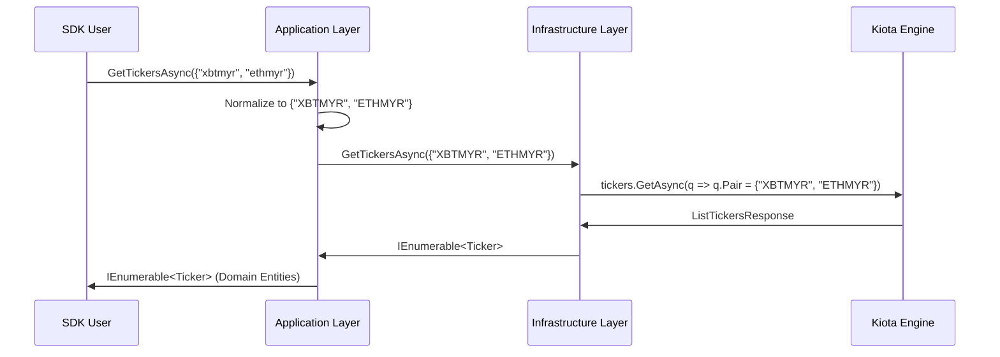

# RFC 007: Multi-Pair Ticker Filtering

**Status:** Draft  
**Date:** 2026-03-13

## 1. Overview
This RFC proposes updating the `GetTickersAsync` method in `ILunoMarketClient` to support optional filtering by trading pairs. This aligns the SDK with the Luno API's `/api/1/tickers` endpoint, which supports multiple `pair` query parameters.

## 2. Motivation
Currently, `GetTickersAsync` is an "all-or-nothing" operation. While RFC 005 addresses single-pair retrieval, consumers often need a specific subset of pairs (e.g., a dashboard tracking only XBT and ETH). Retrieving the full ticker set and filtering client-side is inefficient, increases network payload, and scales poorly as Luno adds more active exchanges. By leveraging server-side filtering, we improve **Performance** and **Developer Experience (DX)**.

## 3. Future State
Developers can retrieve a targeted list of tickers with a single call:
```csharp
var pairs = new[] { "xbtmyr", "ethmyr" };
var tickers = await client.Market.GetTickersAsync(pairs); 
// Returns only requested tickers, perfectly normalized.
```

## 4. Goals & Non-Goals
- **Goals:**
    - Support optional pair filtering in `GetTickersAsync`.
    - **Automatic Normalization:** Ensure all input pairs are converted to uppercase.
    - **High-Fidelity Telemetry:** Emit filter count and pair metadata in telemetry signals.
    - **RFC 004 Compliance:** Use the unified exception hierarchy for all error states.
- **Non-Goals:**
    - Client-side validation of pair identifiers (Delegated to API).
    - Implementing client-side pagination or sorting.

## 5. Proposed Technical Design
### High-Level Architecture
The system will use a decorator-based approach to intercept and filter the request parameters before they reach the Kiota engine. Normalization will happen in the Application layer to ensure the Infrastructure remains "pure" and purely handles the mapping to the API schema.



### Public API Changes
- **Modified `ILunoMarketClient`**:
    - `Task<IEnumerable<Ticker>> GetTickersAsync(IEnumerable<string>? pairs = null, CancellationToken ct = default);`

### Phased Implementation
- **Phase 1: Core Interface Update**
    - **Description:** Update the Market Client interface and add XML documentation for the new parameter.
    - **Core Changes:** Modify `ILunoMarketClient.cs` to include the optional `pairs` parameter.
    - **Locations:** `Luno.SDK.Core/Market/ILunoMarketClient.cs`
- **Phase 2: Infrastructure Mapping**
    - **Description:** Update the `LunoMarketClient` to map the `IEnumerable<string>` to the Kiota query parameter array.
    - **Core Changes:** Update `LunoMarketClient.GetTickersAsync` to pass the `pairs` array to the generated request builder.
    - **Locations:** `Luno.SDK.Infrastructure/Market/LunoMarketClient.cs`
- **Phase 3: Application Orchestration**
    - **Description:** Update the `GetTickersHandler` to implement normalization logic and telemetry metadata.
    - **Core Changes:** Implement `pair.ToUpperInvariant()` loop and add `filter_count` attribute to the telemetry span.
    - **Locations:** `Luno.SDK.Application/Market/GetTickers.cs`

## 6. Behavioral Specifications
### Multi-Pair Filtering with Normalization
- **Given:**
    - A list of lowercase pairs `{"xbtmyr", "ethzar"}`.
- **When:**
    - `GetTickersAsync(pairs)` is called.
- **Then:**
    - The SDK normalizes the input to `{"XBTMYR", "ETHZAR"}`.
    - The request is sent to the API with multiple `pair` query parameters.
    - Telemetry signal `luno.market.get_tickers` includes `filter_count: 2`.

### Error Handling (RFC 004 Integration)
- **Given:**
    - An invalid pair name in the filter list.
- **When:**
    - The API returns a 400 with `ErrInvalidMarketPair`.
- **Then:**
    - The SDK throws a `LunoResourceNotFoundException` via the `LunoErrorHandlingAdapter`.

## 7. Definition of Done
### Quality Gates
- **Functional Coverage**: 100% verified hits for the new filtered paths in both unit and integration tests.
- **Architecture**: Zero leakage of Kiota-specific parameter types to the Application layer.
- **TDD Mandate**: Verification must favor behavioral outcomes over internal state. Avoid mocking internal logic; prefer real collaborators unless external/slow I/O is involved.

### Verification Strategy
- Run `dotnet test --filter "Category=Unit&FullyQualifiedName~Market"`
- Run `dotnet test --filter "Category=Integration&FullyQualifiedName~Market"`

## 8. Alternatives Considered & Trade-offs
- **Alternative A:** Creating a separate `GetFilteredTickersAsync` method. -> Rejected because it adds unnecessary surface area to the API. Optional parameters are more idiomatic for filtering.
- **Trade-offs:** Minimal; ensures the SDK stays thin while empowering power users.
