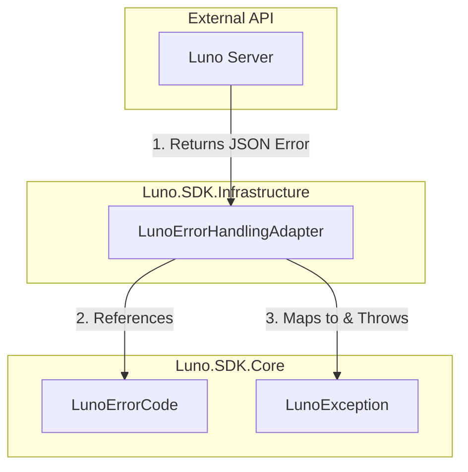

# RFC 008: Centralized Static Error Code Constants

**Status:** Draft  
**Date:** 2024-05-24  
**Author(s):** Gemini CLI

## 1. Executive Summary: The Vision & The Value
- **The What & The Why:** This RFC proposes consolidating all Luno API error code strings into a single, centralized static class `LunoErrorCode` within the `Luno.SDK.Core` project. Currently, these error codes are "magic strings" scattered across the `LunoErrorHandlingAdapter` and potentially other validation layers.
- **Business & System ROI:** Improves maintainability by providing a single source of truth for error codes, enables IDE IntelliSense to prevent typos, and simplifies future SDK updates when Luno introduces new error codes.
- **The Future State:** Developers will use strongly-typed constants (e.g., `LunoErrorCode.ErrAmountTooSmall`) instead of error-prone strings. The `LunoErrorHandlingAdapter` will be cleaner, more readable, and easier to audit against the official Luno API documentation.

## 2. The Status Quo & The Timebombs
- **The Urgency (Why Now?):** The `LunoErrorHandlingAdapter.cs` already contains over 100 hardcoded string literals. As we add more domain-specific validation and error handling, the risk of "string-drift" and silent failures due to typos increases. If we don't centralize now, the technical debt will make future refactoring increasingly painful.
- **The Timebombs (Assumptions):** 
    - Assuming Luno's error code strings are stable and won't change their casing or naming convention without notice.
    - Assuming that the current list in `LunoErrorHandlingAdapter` is exhaustive based on the current spec implementation.

## 3. Goals & The Scope Creep Shield
- **Goals:** 
    - Create `Luno.SDK.Core/LunoErrorCode.cs` containing all known Luno error codes as `public const string` members.
    - Refactor `LunoErrorHandlingAdapter.cs` to use these constants.
    - Ensure 100% parity between the new constants and the existing string literals.
- **Non-Goals (The Shield):** 
    - We are NOT changing the exception hierarchy or the mapping logic itself (that was handled in RFC 004).
    - We are NOT automating the generation of these codes from the OpenAPI spec in this phase (though this RFC enables it later).

## 4. Proposed Technical Design
### 4.1 Architecture & Boundaries
> *Note: Code is temporary; boundaries are forever.*

### 4.2 Public Contracts & Schema Mutations
- **LunoErrorCode Class:** A static class in `Luno.SDK.Core` (to ensure visibility to all layers) containing grouped constants:
    - `Security` (e.g., `ErrUnauthorised`)
    - `RateLimit` (e.g., `ErrTooManyRequests`)
    - `OrderRejected` (e.g., `ErrAmountTooSmall`)
    - `Validation` (e.g., `ErrInvalidParameters`)
    - etc.

## 5. Execution, Rollout, & The Sunset (The Delivery DNA)
- **Phase 1: Foundation**
  - **Description:** Create the `LunoErrorCode` class in `Luno.SDK.Core`. Populate it by extracting strings from `LunoErrorHandlingAdapter`.
  - **Merge Gate:** Unit tests verifying that `LunoErrorCode.ErrX == "ErrX"`.
- **Phase 2: Refactor Infrastructure**
  - **Description:** Update `LunoErrorHandlingAdapter` to reference `LunoErrorCode` constants in its internal `Dictionary`.
  - **Merge Gate:** Existing integration tests for error handling must pass without modification.
- **Phase X: The Sunset (Deprecation)**
  - **The Kill List:** Delete all hardcoded string literals in `LunoErrorHandlingAdapter`.

## 6. Behavioral Contracts (The "Given/When/Then" Specs)

### 6.1 The Happy Path (Constant Integrity)
- **Tier:** Unit
- **Given:** The `LunoErrorCode` class.
- **When:** Accessing a member like `LunoErrorCode.OrderRejected.AmountTooSmall`.
- **Then:** It must return the exact string `"ErrAmountTooSmall"`.
- **Verification:** Simple unit test checking constant values.

### 6.2 The Chaos Path (Mapping Parity)
- **Tier:** Unit
- **Given:** An `ApiException` with code `"ErrAmountTooSmall"`.
- **When:** Passed to `LunoErrorHandlingAdapter`.
- **Then:** It must throw `LunoOrderRejectedException`.
- **Verification:** Mock `IRequestAdapter` to throw `ApiException` and verify the caught exception type.

## 7. Operational Reality (The Anti-P1 Guardrails)
- **Blast Radius:** Low. This is a refactoring of internal constants. If a constant is wrong, the mapping will fall back to a generic `LunoApiException`.
- **Capacity & Financial Breaking Points:** N/A. Static constants have zero runtime overhead compared to string literals.
- **Observability:** No change to logging or telemetry.
- **Security & Compliance:** No PII involved.

## 8. Disaster Recovery & The Panic Button
- **The "Panic Button":** Standard git revert of the refactoring PR.
- **Data Safety:** No data persistence is affected.

## 9. The Pre-Mortem & Trade-offs
- **Rejected Options:** 
    - *Enums:* Rejected because `ApiException.Code` is a string, and converting to Enums would add unnecessary parsing overhead and complexity for little gain over `const string`.
- **The Pre-Mortem:** If this fails, it's likely because a typo was introduced during the manual extraction of 100+ strings. We mitigate this with a "Parity Test" that compares the new constants against a list of expected strings.

## 10. Definition of Done
- **Verification Strategy:** 
    - A unit test project in `Luno.SDK.Tests.Unit` that asserts the value of every constant in `LunoErrorCode`.
    - `LunoErrorHandlingAdapter` fully refactored and building.
- **TDD Mandate:** 100% pass rate on all error handling tests. Zero mocking of the `LunoErrorCode` class (use the real constants).
