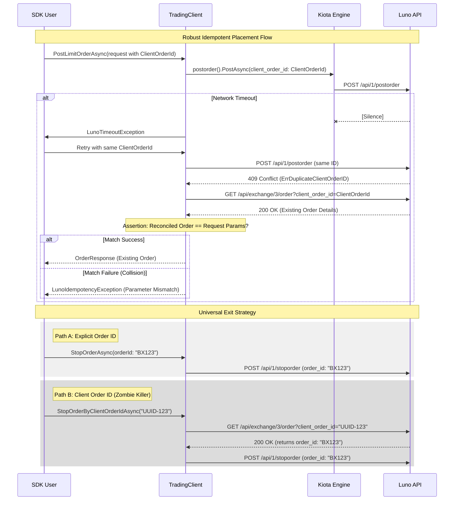

# RFC 006: Trading Client and Order Lifecycle Management

**Status:** Implemented ✅  
**Date:** 2026-03-16

## 1. Overview
This RFC proposes the introduction of a new `ILunoTradingClient` to handle high-fidelity order lifecycle management. The scope includes idempotent limit order placement (`POST /api/1/postorder`) and a universal exit strategy for order cancellation (`POST /api/1/stoporder`).

## 2. Motivation
The Luno SDK currently lacks interaction with the exchange's order book. To build robust financial applications, users must not only be able to place orders but also cancel them to mitigate risk. Furthermore, in a financial system, network timeouts during order placement cannot be handled via "reconnaissance" documentation; they require a native, SDK-managed **Idempotency Strategy** (leveraging Luno's `client_order_id` and 409 Conflict reconciliation) to prevent duplicate execution.

## 3. Future State
Developers can place idempotent orders and cancel them through an explicit, type-safe API:
```csharp
// 1. Place an idempotent order
var order = await client.Trading.PostLimitOrderAsync(new PostLimitOrderRequest
{
    Pair = "XBTMYR",
    Type = OrderType.Bid,
    Volume = 0.001m,
    Price = 250000m,
    ClientOrderId = "unique-uuid-123" // Mandatory for idempotency
});

// 2. The Exit Strategy (Works even if the placement timed out!)
await client.Trading.StopOrderByClientOrderIdAsync("unique-uuid-123");
```

## 4. Goals & Non-Goals
- **Goals:**
    - Introduce `ILunoTradingClient` for order lifecycle management.
    - **Robust Idempotency:** SDK-managed reconciliation of `HTTP 409 Conflict` via `/api/exchange/3/order`.
    - **Reconciliation Assertions:** Validate that reconciled orders match the request parameters (Price, Volume, Type).
    - **Universal Exit Strategy:** Explicit `StopOrderAsync` (by Luno ID) and `StopOrderByClientOrderIdAsync` (by Client ID).
    - **Model Integrity:** Expose `StopPrice` and enforce pre-flight validation for `PostOnly` exclusivity.
- **Non-Goals:**
    - Implementing Market Orders (`POST /api/1/marketorder`) in this RFC (Phase 2).
    - Implementing sophisticated algorithmic trading helpers.

## 5. Proposed Technical Design
### High-Level Architecture


### Public API Changes
- **New Interface `ILunoTradingClient`**:
    - `Task<OrderResponse> PostLimitOrderAsync(PostLimitOrderRequest request, CancellationToken ct = default);`
    - `Task<bool> StopOrderAsync(string orderId, CancellationToken ct = default);`
    - `Task<bool> StopOrderByClientOrderIdAsync(string clientOrderId, CancellationToken ct = default);`
- **Updated `PostLimitOrderRequest`**:
    - `public string? ClientOrderId { get; set; }` (Mapped to `client_order_id`).
    - `public decimal? StopPrice { get; set; }` (Mapped to `stop_price`).
    - `public StopDirection? StopDirection { get; set; }` (Mapped to `stop_direction`).

### Phased Implementation
### Phase 1: Trading Core
- **Description:** Define the interface, enums, and request/response models.
- **Core Changes:** Create `ILunoTradingClient.cs`, `OrderType.cs`, and `PostLimitOrderRequest.cs`.
- **Locations:** `Luno.SDK.Core/Trading/`

### Phase 2: Infrastructure & Mapping
- **Description:** Implement the client and map to Kiota's generated types.
- **Core Changes:** Create `LunoTradingClient.cs` and update `LunoClient` to expose the trading client.
- **Locations:** `Luno.SDK.Infrastructure/Trading/`, `Luno.SDK.Application/LunoClient.cs`

### Phase 3: High-Fidelity Error Mapping
- **Description:** Map specific exchange errors to our domain exception hierarchy.
- **Core Changes:** Update `LunoExceptionMapper` for:
    - `ErrInsufficientFunds` -> `LunoInsufficientFundsException`
    - `ErrPostOnly` -> `LunoPostOnlyViolationException`
    - `ErrDuplicateClientOrderID` -> `LunoIdempotencyException`
    - `ErrOrderNotFound` -> `LunoResourceNotFoundException`
- **Locations:** `Luno.SDK.Infrastructure/Exceptions/LunoExceptionMapper.cs`

## 6. Behavioral Specifications
Every specification below defines its **Verification Tier** to ensure high-fidelity coverage with minimum redundancy.

### Successful Idempotent Limit Order Placement (409 Reconciliation)
- **Tier:** Integration
- **Given:** A valid `PostLimitOrderRequest` with a unique `ClientOrderId` that already exists on the exchange.
- **When:** `PostLimitOrderAsync` is called.
- **Then:** The SDK catches the 409 Conflict, performs a lookup, asserts that the existing order parameters match the current request (Price, Volume, Type), and returns the existing `OrderResponse`.
- **Verification:** WireMock injects a 409 Conflict followed by a 200 OK for the lookup endpoint.

### The Exit Strategy: ClientOrderId-based Cancellation
- **Tier:** Integration
- **Given:** A `ClientOrderId` for an open order.
- **When:** `StopOrderByClientOrderIdAsync(clientOrderId)` is called.
- **Then:** The SDK performs a lookup to find the exchange `OrderID` and then stops the order.
- **Verification:** WireMock verifies the lookup call followed by the `POST /api/1/stoporder` call.

### High-Fidelity Error Mapping (Infrastructure Verification)
- **Tier:** Integration
- **Given:** The API returns a trading-specific error code like `ErrInsufficientFunds` or `ErrDuplicateClientOrderID`.
- **When:** A trading request is made.
- **Then:** The SDK throws the correct semantic domain exception mapped by the `LunoErrorHandlingAdapter`.
- **Verification:** 100% path coverage in the integration suite using WireMock error injection to verify the adapter handshake.

### Pre-flight Post-Only Validation
- **Tier:** Unit
- **Given:** A request with `PostOnly = true` and `TimeInForce` equal to `IOC` or `FOK`.
- **When:** `PostLimitOrderAsync` is called.
- **Then:** The SDK throws a `LunoValidationException` before the network call.
- **Verification:** Verified in Unit project to prevent structurally invalid handshakes.

### Explicit Account Mandate
- **Tier:** Unit
- **Given:** A `PostLimitOrderRequest` where `BaseAccountId` or `CounterAccountId` is null, empty, or whitespace.
- **When:** `PostLimitOrderAsync` is called.
- **Then:** The SDK throws a `LunoValidationException` immediately.
- **Verification:** Verified in Unit project to enforce explicit account selection and prevent reliance on exchange defaults.

## 7. Definition of Done
### Quality Gates
- 100% test pass on project-core and project-infrastructure.
- **TDD Mandate:** Verification must favor behavioral outcomes over internal state. **Less is More:** achieve 100% coverage with the minimum number of high-fidelity tests.
- Complete XML documentation for all new public members.

### Verification Strategy
- `dotnet test --filter "FullyQualifiedName~Trading"` (Runs both Unit and Integration tiers).

## 8. Alternatives Considered & Trade-offs
- **Alternative A:** Adding these methods to `ILunoAccountClient`. -> Rejected because account management and active trading are distinct behavioral domains (SRP).
- **Trade-offs:** Minimal trade-offs; adding a dedicated trading client is the standard pattern for high-fidelity exchange SDKs.

## 9. Financial Breaking Points
- **Rate Limiting:** Trading endpoints share the global rate limit of **300 calls per minute**.
- **Idempotency Window:** `client_order_id` deduplication is typically cached by the exchange for a limited window. Retries after many hours may result in duplicate orders if the original ID is purged.

## 10. Pre-Mortem
- **Failure Scenario:** The user provides a volume that is below the pair's "Minimum Trade Volume".
- **Mitigation:** Future RFCs should include a "Pair Metadata" service to allow the SDK to perform client-side pre-validation.

## 11. The Kill List
- **Killed:** The ambiguity of "Account" vs "Trading" responsibilities.
- **Killed:** Manual handling of duplicate orders via documentation.
- **Killed:** "Hotel California" trading (entering without an exit strategy).
- **Killed:** Manual parsing of error strings for critical trading failures.

---

## Appendix A: Luno API Parameter Mapping
The `PostLimitOrderRequest` must expose the following parameters from the `POST /api/1/postorder` endpoint to ensure feature parity with the exchange.

| SDK Property | API Parameter | Type | Description |
| :--- | :--- | :--- | :--- |
| `Pair` | `pair` | `string` | **Mandatory.** The currency pair to trade (e.g., "XBTZAR"). |
| `Type` | `type` | `OrderType` | **Mandatory.** `BID` or `ASK`. |
| `Volume` | `volume` | `decimal` | **Mandatory.** Amount of crypto to buy/sell. |
| `Price` | `price` | `decimal` | **Mandatory.** Limit price. |
| `BaseAccountId` | `base_account_id` | `long` | **Mandatory (SDK).** The base currency Account ID. |
| `CounterAccountId` | `counter_account_id` | `long` | **Mandatory (SDK).** The counter currency Account ID. |
| `ClientOrderId` | `client_order_id` | `string?` | **Idempotency Key.** Unique UUID for deduplication. |
| `TimeInForce` | `time_in_force` | `TimeInForce?` | `GTC` (Default), `IOC`, or `FOK`. |
| `PostOnly` | `post_only` | `bool?` | If true, order is cancelled if it trades immediately. |
| `StopPrice` | `stop_price` | `decimal?` | Trigger price for stop-limit orders. |
| `StopDirection` | `stop_direction` | `StopDirection?` | Side of the trigger price to activate the order. |
| `Timestamp` | `timestamp` | `long?` | Unix timestamp in milliseconds for request validity. |
| `TTL` | `ttl` | `long?` | Milliseconds after timestamp for request expiration. |
## 12. Architectural Refinement (Implemented Phase)
During implementation, the architecture was further refined to address SOLID violations caught during auditing:
- **Tiered ISP**: Split `ILunoTradingClient` into `ILunoTradingOperations` and `ILunoTradingClient` to decouple handlers from the orchestration dispatcher.
- **Generic Pipeline**: Replaced manual decorators with `IPipelineBehavior<TRequest, TResponse>` for composable cross-cutting concerns (logging, validation).
- **DI Discovery**: Transitioned from a manual factory to automatic assembly scanning via `Microsoft.Extensions.DependencyInjection`.
- **CLI Demonstration Architecture**: The CLI implementation (`Concept06_Orders.cs`) utilizes `sealed record` types for parameter encapsulation and C# 14 switch expressions for declarative exception handling to separate local configuration errors from API rejections.
